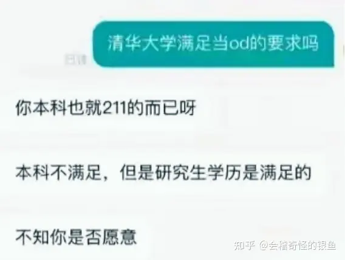

# 无内鬼，来点计算机笑话

## 免责声明与投稿须知

尊敬的用户和贡献者：

感谢您访问和参与我们的笑话集锦项目！我们致力于创建一个健康、积极、充满乐趣的在线社区。在使用本项目前，请仔细阅读以下声明和须知：

### 免责声明

1. 版权与原创性：
   - 我们鼓励分享和创作原创内容。所有投稿至本仓库的笑话，投稿者需确保拥有其版权或已获得相应授权。
   - 若您发现任何侵犯版权的内容，请通过邮箱：`dante.song@foxmail.com`联系我们，我们将迅速采取行动。
2. 内容准确性与适用性：
   - 本仓库中的笑话仅供娱乐，我们不保证所有内容的准确性、完整性或适用性。
   - 阅读和使用本仓库内容引发的任何后果，包括但不限于心理不适、身体伤害等，我们不承担法律责任。
3. 文化敏感性与尊重：
   - 我们尊重多元文化，避免包含歧视性或冒犯性的内容。任何违反社区准则的投稿将被移除。
   - 用户应自觉遵守当地法律法规，尊重他人，避免上传任何可能引起不适或争议的内容。
4. 更新与修改：
   - 本仓库有权随时更新、修改或删除内容，无需事先通知。
   - 所有变更将在仓库的README文件或相关公告中公布。
5. 博君一笑，请勿当真：
   - 本仓库中的所有内容仅供娱乐和幽默之用，任何笑话或故事均不代表任何个人、组织的观点或立场。我们鼓励用户以轻松的心态对待内容，避免过度解读或引申。

### 投稿须知

1. github
   - 提交PR（Pull Request）：我们鼓励使用GitHub的PR功能进行投稿，便于跟踪和讨论。请先阅读CONTRIBUTING.md文件了解投稿指南，然后通过提交PR的方式添加或修改笑话。
   - 遵守社区规范：所有投稿必须符合社区的行为准则，不得包含违法、侵权、歧视性内容。
   - 审核流程：所有PR将经过审核，我们保留拒绝不符合要求投稿的权利。
2. 通过电子邮件投稿
   - 如果您更倾向于通过电子邮件投稿，也欢迎这样做！请发送邮件至`dante.song@foxmail.com`，并在邮件主题中注明“笑话投稿”。
   - 每封投稿邮件应包含您的姓名（或昵称）、笑话文本及任何必要的版权说明或授权信息。
   - 请注意，通过电子邮件投稿可能需要更长的处理时间，我们会尽快回复。

通过继续使用本仓库，您被视为同意上述条款。我们鼓励大家共同维护一个友好、包容的社区环境，期待您的积极参与！

## 计算机圣经

### 全军复颂！《计算机圣经》

第一章:高考报志愿二本计算机>985文科，狠狠赚一笔

第二章:C语言程序设计(谭浩强)数据结构(严蔚敏)

第三章:bilibili大学

第四章:瑞吉外卖谷粒商城黑马点评

第五章:BOSS直聘已读不回

第六章:小厂也是厂2000我也干

第七章:半年实习生一生JAVA情

第八章:失业转行码农卖炒粉

第九章:码农烧烤

第十章:码农探花

### 程序员的前半生

第一步：沉淀

第二步：那场寒冬毁了我的高薪梦

第三步：外包也是工作

第四步：两年程序员，一生极客情

第五步：送外卖也是美团员工

第六步：老同学，我想你了，回来吧icpc队友

第七步：码农烧烤

第八步：烧烤店倒闭，码农维修

第九步：行业不吃香，码农代驾

第十步：吊销驾驶证，碧桂园五星上将

第十一步：嘴笨教训不了不知好歹的业主，身体羸弱也欺负不了落单的外卖员，遇到危险只能活活挨打

第十二步：公司若缺人召必回

### 立本人出列

一歩目の大学入試新聞志願二冊コンピューター>985文系

第二歩c言語プログラミング（譚浩強（データ構造（厳蔚敏）

第三歩bilibili大学

第四歩瑞吉出前谷粒商店街黒馬評

第五歩BOSS直雇）既読に戻れない

第六歩小工場も工場である（3000私も

七歩目の半年実習生一生JAVA情

第八歩失業転職コード農バーベキュー農探花

### 2023年底了，马上2024年了，现在转行计算机行业往哪个方向转呢？

1. 前端转前台

2. 后端转后厨

3. 信安转保安

4. 电商转地商

5. 通信转送信

6. 软件转软饭

7. 硬件转送件

8. 系统转送桶

9. 电路换马路

10. 自动转手动

**评论**：

- 错误的，前端转前厅，餐饮没有前台。为什么我知道，因为我是真在
- 前台端菜也是前端😡不要小看我们前端啊😅
- 不会后厨的前端不是好后端🙃
- 为各行各业舔砖Java，为客户Python到家

### 计算机现状

第一章：沉淀

第二章：放弃梦想，计算机狠赚一笔

第三章：谁说N非本985硕不是985！

第四章：秋招bat任我挑选，华子保底我才不去！

第五章：测试也是开发

第六章：销售也是互联网

第七章：那场寒冬毁了我的大厂梦

第八章：谁说比亚迪不是大厂？

第九章：迪子啊！我不能没有你

第十章：考公考编有何不好？

第十一章：我狠这不公的世界！

第十二章：小厂工作也是工作！

第十三章：两年互联网，一生极客情

第十四章：送外卖也算进大厂

第十五章：老同学，我想你了，回来吧icpc队友

第十六章：码农烧烤

第十七章：烧烤店倒闭，码农维修

第十八章：行业不吃香，码农代驾

第十九章：吊销驾驶证，碧桂园五星上将

第二十章：停车场悟道！

终章：失去应届资格的我，该何去何从？

续章：重生之我是蔡徐坤

### 考研现状

第一步：背水一战备战考研

第二步：11408毁了我的考研梦

第三步：非全也是硕

第四步：成绩出了，没过200分，不能调剂

第五步：二战

第六步：三战

第七步：考研没用，备战考公!

第八步：考公失败，家里蹲，父母冷眼相待

第九步：准备进BBA等大厂拿50w年薪

第十步：比亚迪也是大厂！od 也是华为！

第十一步：高中同学我想你们了

第十二步：两年程序员，一生码农情

第十三步：教训用苹果的相亲对象

第十四步：被裁员

第十五步：码农烧烤

第十六步：烧烤店倒闭，码农维修

第十八步：送外卖也算进大厂

### 计算机参考书目

- 《c语言——从研发到脱发》
- 《C++——从入门到入土》
- 《Java——从跨平台到跨行业》
- 《Ios开发——从入门到下架》
- 《Android开发大全——从入门到转行》
- 《PHP——由初学到搬砖》
- 《黑客攻防——从入门到入狱》
- 《Mysql——从删库到跑路》
- 《服务器运维管理——从网络异常到硬盘全红》
- 《服务器运维管理——从网维到网管》
- 《Office三件套——从入门到手写》
- 《Debug455个经典案例——让电脑开机蓝屏》
- 《零基础学c语言——学完负基础》
- 《Css——从绘制框架到改行画画》

## Java圣经

### Java圣经1

网上都是在制造焦虑，实际上根本没那么严重，我普通二本，一年经验，北京面了3家，拿了4个offer，最高32k，最低27k 32k是外包，还有个30k的自研可以考虑一下，不说了，明天还要两个面试，寒冬年年有，年年都是计算机，结果计算机工资不是还是轻轻松松月入过2w。xdm，有一说一，现在不学JAVA，以后就没机会了，趁着现在的红利，狠狠的赚一笔。

### Java圣经2

我笑死了，一个个都怕卷到自己，都劝退java，实际呢？还不是机械5k是东山再起，计算机20w尽显颓势。我小学毕业就出来打工四处碰壁，直到我碰见了java，参加了java培训，毫不夸张，只要你好好学，出去两万是保底的事，都说java学的多，实际呢？也不过就spring，微服务，并发那些罢了，一个月学俩门，一个半月就能拿下，以后java必是蓝海专业，国家大力发展数字经济，所谓大佬也不过就是顺应局势罢了，当你们还在讨论今年java已死的时候，我已经拿到5个offer了，差距就是这样打开的。

### Java圣经3

都说JAVA开发很赚钱， 我苦心专研了两年，其中参加了不少的培训。
刚培训完两个星期我就收到了美团网的offer , 我承认我不是班里学习最好的。
但我却是班里第一个找到工作的， 而且还是个大厂我一-直相信勤能补拙。
只要有决心什么事都是可以做到的，今天入职一个星期了。
公司的人对我都很好，还给我配了电动车和头盔还有大衣。
不说了马上超时了。

### 《JAVA工程师》

你说的对，但是《JAVA工程师》是由Sun Microsystems自主研发的一款全新开放世界编程游戏。游戏发生在一个被称作「传智播客」的幻想世界，在这里，被神选中的人将被授予「IDEA」，导引接口之力。你将扮演一位名为「码农」的神秘角色，在充满限制的探访中邂逅性格各异、能力独特的面试官，和他们斗智斗勇，找回反应产生的八股文和简历包装——同时，逐步发掘「月薪过万，就上黑马程序员」的真相。

### 大阪圣经

ネット上の人は、ほとんどが不安を広げています。実際は、そんなに深刻ではありません。第二段階の大学卒で、一年経験があります。上海で8つの面接を取り、4つの内定をもらいました。最小は17kで、最大は22kです。22kのは派遣で、まだ20kの自社開発も考えています。明日2つの面接ありますので、話はここまでにします。毎年まっ冬で、毎年はコンピューター。結局、コンピューターをやると、簡単に月給万元超えではないでしょうか。皆さん、今日javaを学ばないと、こんなチャンスは二度と来ないです。今の景気の乗って、一所懸命に大金を稼ぎましょう。

### 三字圣经

网制焦，实不严，专毕业，零经验，面八家，十offer，64k，是外包，32k，有自研，明还有，面试多。说寒冬，年年有，计算机，月过万，现不学，没机会，趁红利，狠赚笔。  win！win！win！

**评论：**
前面忘了，中间忘了，后面忘了，只记得狠狠地赚一笔

计算机就业，为各行各业添砖java

沉淀的，说唱的，一米八五的，耐克的，白袜包裤腿根的，双手插兜的，年少轻狂的，大雨毁梦的，与艺术生的恋爱的，顶峰相见的，大专的，义务兵的，辅警的，想战友的，维修的，现实击碎爱情的，代驾的，吊销驾照的，碧桂园的，教训业主的，欺负外卖员的，月薪三千拼什么命的，若有战召必回的，老兵烧烤的，码农探花的。

### Java面试第一题

面试第一题：Java语言有哪些特点？

1. 简单易学，有丰富的岗位。
2. 面向社会（摆摊、外送、内卷三大特征）
3. 平台无关性（美团、饿了么）

## 九二传奇

### Top1圣经[天坑版]

第一步：沉淀

第二步：那泡稀毁了我的数竞梦

第三步：清华天坑也是清华

第四步：清华总比上交好

第五步：高三，我怀念的

第六步：备战托福GRE

第七步：申博全聚德了

第八步：清北学神教你学数学

第九步：教培被砍，决定走人才引进入编

第十步：苏州高新区街道办yyds

第十一步：四年清华人，一生清华情

### Top2圣经[强基计划]

第一步：沉淀

第二步：那场大雨毁了我的普通批梦

第三步：强基计划也是北大

第四步：21世纪是生命科学的世纪

第五步：国庆不调休放九天，特种兵式游北方

第六步：那场疫情毁了我的北大生活

第七步：五一校庆连放九天，特种兵式游南方

第八步：强基大会，暂时不能给你明确的答复

第九步：直博失败，准备考研

第十步：考研失败，准备考公

第十一步：生科的终点是保安

第十二步：永远怀念燕园的阳光

### Top3圣经

#### USTC圣经

个人版（如有雷同，纯属巧合）：

第一步：沉淀。

第二步：高考发挥失常毁了我的状元梦。

第三步：草，没失常，浪费了！算了，USTC也是TOP 3。

第四步：招生老师让我改志愿，改选计算机。

第五步：怎么有这么多物理课，听不懂，反正我不是来上物理系的。

第六步：​计算机课也听不懂。高三满状态的我，我怀念的。

第七步：高数60，线代60，操作系统60，编译原理60，近物60，光学60，力学60，二级60，三级60，四级60......，20门60不挂科，大学就要图个刺激....

第八步：GPA2.7，无实习无答辩提前1年毕业，读了个水本？搞学术不适合我，社会我来啦。

第九步：《​从零开始21天学会C++》，C++是最好的语言。

第十步：​上班2月，公司倒闭。

第十一步：​垃圾C++找不到工作，《从零开始21天学会Java》，Java才是最好的语言。

第十二步：上班3月，公司又倒闭。工作有毒，还是润吧。

第十三步：​6个月冲刺，一定要拿下GT。常春藤我要来啦。

第十四步：只有不求上进的人才选择在上海买房，我的征途是星辰大海。

第十五步：​GT太难，不考了。新加坡水硕也是硕，给生活费就叫全奖。

第十六步：​新加坡我来啦，让你们看看中华顶尖做题家的实力，实战技术高手对校园的碾压。

第十七步：​8门C，就说学术不适合我，社会我又来啦。

第十八步：都是垃圾工作，配不上我。算了，500强的供应商也是500强，先干着。

第十九步：​面试，香港上海公司？起这种名字的公司开到新加坡是个什么垃圾？哦，是汇丰，我就说应该去500强。

第二十步：​500强不适合我，还是去创业公司吧

第二十一步：​创业公司上班1个月，怎么突然全公司就只剩下我一个人了。

第二十二步：​集团CEO让我拯救公司，SSE一夜成为CTO是什么体验。我就说我是小说主角。

第二十三步：​垃圾公司，早该辞职了。

第二十四步：​新加坡配不上我，还是要去美国。

第二十五步：只有不求上进的人才选择在新加坡买房，我的征途是星辰大海。

第二十六步：​华尔街我来啦，contractor也是华尔街。

第二十七步：​入职1月，基金清盘。怎么倒闭节奏越来越快了.......

第二十八步：​清盘要1年多，外面金融危机，先苟着。

第二十九步：​妈的，怎么会在失业率最高的时候清盘完成。

第三十步：​搞金融数据也是搞金融，写代码就是quant。

第三十一步：​换工作，投行的后台也是投行。

第三十二步：​再换工作，资管也一样可以叫做对冲基金。

第三十三步：​累了，金融不适合我，还是去传统公司降维打击。

第三十四步：​传统公司也不适合我，躺平。我最看不起奋斗逼，摸鱼yyds。

第三十五步：​星辰大海就是买房。

第三十六步：没意思，​不丁克了，生孩子吧。

第三十七步：​生不出孩子，求助试管。

第三十八步：​试管不给力，都是骗人的。父母催娃的压力山大。

第三十九步：​找DY，一年追4，父母懵了。

第四十步：​一场疫情毁了我们的回国养娃计划。

第四十一步：漕，4个娃出生了可是不能带回国。我们该怎么自己带，急，在线等。

第四十二步：5个保姆，​养娃原来一点都不难。

第四十三步：​再生3个，朋友圈懵了。

第四十四步：​9个保姆，养娃原来一点都不难。

第四十五步：怀念丁克。

#### 中科大也是Top3

第一步：沉淀

第二步：高二参加高考，去什么清北，少年班我来了！

第三步：那场大雨毁了我的少年班梦

第四步：继续沉淀

第五步：合肥怎么了？离北京远，离纽约近。

第六步：gpa不够转不了物院，什么下头学院男女比7:1

第七步：互联网行业一片大好，信息学院赢麻了

第八步：参加学生会 线电考60分 没有重修的大学不完整

第九步：垃圾学校没有人文氛围。迎新晚会没经费，还好中科眼镜赞助500块

第十步：四战雅思口语上6，新航道还奖励500块。带英/坡县/香港我来啦！

第十一步：IC gpa要求85。有这gpa爷不去美帝？

第十二步：NUS也是top1

第十三步：继续沉淀。别人一年读完找不到工作落不了户口，我读一年半赢在中国

第十四步：找到实习，在后台岗写代码怎么了？只要穿上衬衫领带都算投行精英

第十五步：毕业没有论文怎么了？照样进互联网

第十六步：今天的最好表现是明天的最低要求

第十七步：反垄断/上市未遂/国家整改没关系。利空出尽就是利好，因为相信所以看见，股价会有会到200的一天。

第十八步：我永远怀念肥西路的鸡蛋灌饼

### 中科院圣经

#### 中国科学院大学[生化环材转码版]

第一步：沉淀

第二步：拼搏百天，考上中国科学院大学

第三步：​院士，我来了！

第四步：那一年我睡在实验室，奋斗的日子

第五步：实验室火灾，我的数据....

第六步：那场实验失败毁了我的科研梦

第七步：没抑郁过的研究生生涯不完整

第八步：水刊也能毕业

第九步：导师不让发水刊，延毕

第十步：生化环材工作真难找

第十一步：985生化环材不如二本计算机，转码

第十二步：计算机不稳定，我还是考公

第十三步：谁懂啊，三不限太卷，140未进面

第十四步：爸妈说堂堂硕士家里蹲，给他俩丢脸

第十五步：舍友转码在字节，一年五十万

第十六步：报个培训班，5000起步我也要干

第十六步：感谢资本家收留

第十七步：努力一年，我要进大厂

第十九步：解散的决定跟大家的工作质量没有关系

第二十步：继续在出租房沉淀半年

第二十一步：华为od也是华为

第二十二步：妈妈，我扛不住了，我想回家

第二十二步：只有入职和离职的两天是开心的

第二十三步：打工是不可能打工的，我要创业

第二十四步：创业第一天，亏了30，收摊回家

第二十四步：...

第二十六步：我永远难以释怀报志愿那天晚上

#### 土硕传奇

第一步：沉淀

第二步：普通班逆袭清华，争做高考黑马

第三步：高考估分怎么也是985

第四步：末流211也是211

第五步：拼搏三年，准备保研弥补清华物理梦

第六步：79分的绩点也是3.0

第七步：60分也是及格

第八步：没有挂过科的大学是不完整的

第九步：低分也有机会qs300

第十步：暴雨的南京流产了我的雅思7.0梦

第十一步：准备考研，目标工科985

第十二步：很正常，百分之七十的人都没过国家线

第十三步：中科院也能堪比985

第十四步：不在乎三百的分数，上岸了就是英雄

第十五步：我永远怀念高三的梦想。

### 上交圣经

#### 上交圣经[军工版]

第一步：沉淀

第二步：那场大雨毁了我的清华梦

第三步：上交也是世一大（心虚

第四步：录取，在此一搏！

第五步：致远没录上，工科大平台也能闪耀

第六步：选择自动化，成为人上人！

第七步：没挂过科的大学不完整

第八步：考研本校本专业，天胡局告诉我怎么输！

第九步：那场疫情毁了我的上交梦

第十步：航天院也是研

第十一步：成为牛马，开启8117工作制

第十二步：跑路大厂，英伟达我来了！

第十三步：实习期被裁，回老家考公

第十四步：考公失败，转行送外卖

第十五步：老航天烧烤

第十六步：碧桂园五星上将，欺负落单的外卖员，教训不听话的业主，遇到歹徒全身而退

第十七步：若有战召必归！

#### 上交传奇

第一步：沉淀

第二步：联赛拉爆你男友两道题

第三步: 那年黑幕毁了我的清北梦

第四步: 致远NB, 海外资源吊打清北

第五步: 那场疫情毁了我的海外交换梦

第六步: 交大荣誉学院转战清北夏令营 #愿顶点相见

第七步: 简历关被拒, ddl最后一晚申请本校保底

第八步: 直博优先毁了我的推免梦

第九步: 致远connection多课程含金量高, 绩点3.0冲击藤校

第十步: 藤校有眼无珠, 港新伯乐相马

第十一步: 谁说纯数和统计不好就业

第十二步: PR政策突变, 当地就业无望

第十三步: 谁说水硕不能读博

第十四步: 美国top200导师把我鸽了

第十五步: 交大RA, 我来咯

第十六步: RA压力太大, 闵行郊区小学合同工 yyds

第十七步: 一朝致远, 终身荣誉

### 复旦圣经

第一步 沉淀

第二步 那道大题毁了我的清北梦

第三步 清北复交不可取代

第四步 浙大别来尬黑，是top4不是华五

第五步 学校水平不重要，上海总比杭州强

第六步 高三，我怀念的

第七步 gpa只有3.3？外校人均3.9？我要给我的硕士完美的一生！

第八步：申请全聚德了，遥不可及的留学梦

第九步：港三新二我来啦

第十步：录了10043没录我

第十一步：复旦up|怀念光华楼下自习的日子

### 南大圣经

1. 沉淀
2. 那场大雨毁了我的北大梦
3. 南大浦口校区也是PKU
4. 没谈过恋爱的大学生活才是完整的
5. 把南大称作985的无非以下以下三种人——
6. 高三，我怀念的
7. 保研失败，准备考研
8. 嫌考研太累，出国去了
9. 雅思一战5.0 天妒英才
10. 多花5万读语言班
11. QS20（汉语言文学专业一年授课硕）offer到手，英国我来啦！
12. 找国内本科生代写作业
13. 思想情切（且PR失败）准备回国
14. 我永远怀念英国
15. 在家陪父母（因为考公失败）
16. 留学机构学霸mentor

#### 武大英硕

如有雷同，纯属巧合

第一章 沉淀

第二章 那场大雨毁了我的北大梦

第三章 武大也是南方小北大

第四章 没挂过科的大学生涯不完整

第五章 烧炉子也算做物理

第六章 拼搏半年，我要上北大物理

第七章 高三满状态的我，我怀念的

第八章 无所谓，我软实力很强

第九章 报机构过个雅思先

第十章 top50MSc我来啦

第十一章 有没有陆本代写作业的渠道

第十二章 毕业咯！名校硕士毕业咯！

第十三章 h1b抽不中，回国我也是海龟硕士

第十四章 太卷啦，世界名校硕都过不了简历关

第十五章 什么？高中母校要求博士起步

第十六章 小学科学老师也算物理教职

第十七章 我永远怀念的时光

### 华五守门员

阿哈的信徒来了全开了（

第一步：沉淀

第二步：那场大雨毁了我的初赛

第三步：自招过线，清北我来了

第四步：那场羟基毁了我的自招梦

第五步：从头再来，奋斗的高三最美丽

第六步：那场疫情毁了我的高考梦

第七步：华五守门员也是华五

第八步：熬夜复习，怀念满状态的高三

第九步：老师，菜菜，捞捞

第十步：没有搬过砖的大学生活不完整

第十一步：同学全都润计算机，我还在坚守化学梦

第十二步：冲击美国phd，奋斗一个月托福要上岸

第十三步：陶瓷，石沉大海也不能浇灭我的信念

第十四步：签证被check

第十五步：延毕也是毕业

第十六步：毕业回国，非升即走

第十七步：这么多篇论文却不能让我留下

第十八步：转战教培行业，有意者私

第十九步：再次失业，备战考编

第二十步：年龄太大，上岸失败

第二十一步：永远怀念阿美莉卡的生活

### 武大圣经

第一步:市模考前20，人大我来了～

第二步:沉淀

第三步:那泡稀回了我的明德梦

第四步:怎么也是学科评估号称前三和清北并列

第五步:珞珈山上王牌军才能培养出珞珈学派

第六步:非T14 G5我不去

第七步:你武本科也可以进省直市直or广深红圈

第八步:申请失败，实习0offer

第九步:合同制法官检察官助理也是法官检察官

第十步:书记员也是法检的

第十一步:书记员招考没过，辅警我来了

第十二步:法院检察院保安也是特勤，四舍五入算法警

第十三步:感恩母校，在法院检察院门岗普法被晋升到民办派出所了

第十四步:荣升碧桂园五星大保安官

第十五步:永远怀念珞珈山下一段青春

### 华科圣经

#### 华科圣经1

第一步: 沉淀

第二步: 那场大雨毁了我的清北华五梦

第三步: 懂不懂清北华武的含金量

第四步: 嘻哈开济 舒克贝塔别来碰瓷

第五步:​ 华科至少是中九，好好努力未来也可期！

第六步: 高三，我怀念的

第七步:沉淀#为保研而努力#

第八步: 那群卷王毁了我的保研梦

第九步: 没有考研的大学生涯是不完整的。清华我来了。

第十步：考研一战失败没过线

第十一步：二战考研进复试啦！未来的你一定会感谢现在努力的自己

第十二步：复试被刷，这些老师真下头，懂不懂985倒一＞双非第一啊？

第十三步：被迫找工作，我一定可以拿到惊艳所有人的offer

第十四步：家人们，投了几百份简历没人回正常吗？

第十五步：沉淀#刷行测申论

第十六步：考公失败。

第十七步：我永远怀念华科的梧桐絮。

#### 更适合华科饱饱的英硕沉淀↓

第一章：沉淀

第二章：保送省Top3高中，清北华五我的梦

第三章：两道数学大题毁了我的清北梦

第四章：华中科技大学也是985，华科武大也是华5

第五章：材料是二十一世纪最伟大的科学

第六章：四年材料人，一生材料情

第七章：绩点88.3，卷王毁了我的保研梦

第八章：啃老冲帝国理工

第九章：英硕Top10也是Top10

第十章：如果你厌倦了伦敦，你也就厌倦了生活

第十一章：免签国家去个遍

第十二章：谁懂啊家人们英硕真的很难在国内找工作

第十三章：感恩新能源行业，感恩公司学历厂点击就送

第十四章：中国制造顶峰相见

第十五章：螺栓也是金属材料，打螺栓也是研发岗

第十六章：永远怀念韵酒热干面，一年英硕，一生怀念

#### 华科网安

坐标华科网安

第一章：沉淀！

第二章：那道选择题，破坏了我的清北梦

第三章：明德厚学、求是创新

第四章：乾坤未定，你我皆是黑马

第五章：我来这里，是为了国际视野和更高的平台

第六章：网络安全就是国家安全

第七章：保研线30%+，有手就行

第八章：信数密码60+，卷狗太多了

第九章：网安是实践的学科

第十章：网安实验我*&#

第十一章：专业分流，只有网络安全才是真的网安

第十二章：坐牢，锻炼坐冷板凳的耐性

第十三章：网安基地毁了我的大学生活

第十四章：出国才是顶尖学子的选择，我要读phd

第十五章：备考托福，目标100

第十六章：80也能申四大，标准线上众生皆平等

第十七章：普林还是MIT

第十八章：UCSB也行

第十九章：QS前100也行

第二十章：不是cs也行

第二十一章：香港也行

第二十二章：有offer就行

第二十三章：提交了网申就行

第二十四章：注册账号就是胜利

第二十五章：gap year，积累经历，我要拿回属于我的一切

第二十六章：网络安全没有门槛，只有弱者需要学历证明自己

第二十七章：径河路就业，兼职基地保安，离网安最近的地方

第二十八章：我永远怀念在西十二的日子

### TJU圣经

第一步 沉淀

第二步 那年高考一泡稀毁了我的清北华五梦

第三步 TJU也是T大，985YYDS

第四步 沉淀 海外名校见

第五步 GRE和托福毁了我的海外名校梦

第六步 要保研就保华五人大

第七步 学院行政卡了我的推荐信

第八步 只要不保本校怎么都行

第九步 BIT是北京985，提档线老高了

第十步 我要做科研卷王，硕士哐哐发论文

第十一步 论文算个P，科研都是骗人的，我这种人才硕士毕业了就得去上班！

第十二步 实习单位氛围辣眼，你们不配拥有我这样的雇员，我要读博

第十三步 清北人大才配要我

第十四步 只要来了T大，就是T大人，谁说清本才是T大的

第十五步 成绩垫底无所谓，博士生不看成绩。我要发最顶的期刊！

-----------以上都是真的（有玩笑属性）----------以下为虚构整活儿-------

第十七步 审稿人你懂不懂科研？我的大作你都敢拒？

第十八步 学界看不到我的才华

第十九步 毕业就失业/没能成功毕业

第二十步 T大我想你了，一日T大人，终生T大魂

第二十一步 T大失业博士/辍学博士生博主谈内卷

第二十二步 开通自媒体账号T大学长教你XXXXXXXXXX

第二十三步 我永远怀念紫荆园的四层的红三剁

### 中大圣经

#### 中大圣经[港三硕版]

第一步：沉淀

第二步：那泡稀毁了我的清北华五梦

第三步：中山大学也是前十

第四步：武大武二北航南开同济北师c2别来尬黑沾边

第五步：大湾区总比北方985强

第六步：高三，我怀念的

第七步：定向保研本校？我要给我的硕士完整的一生！

第八步：考研失败，遥不可及的北大梦

第九步：准备文书，申请美硕

第十步：家里没钱

第十一步：港三一年制我来了

第十二步：我永远怀念香港

#### 双鸭山医学版

第一步：沉淀

第二步：那场大雨毁了我的临八梦

第三步：双鸭山也是985

第四步：考u在此一搏

第五步：那场口罩毁了我的出国梦

第六步：九院整形世界第一，保研有手就行

第七步：没有经历过考研的人生不完整

第八步：手外科也算整形

第九步：去KI我能行

第十步：那场制裁毁了我的北欧梦

第十一步：转博有手就行

第十二步：没有想不出idea的科研生涯不完整

第十三步：发一篇四区我能按时毕业

第十四步：没有延毕我的硕士生涯不完整

第十五步：阿姆斯特丹是个人就能去

第十六步：东欧也是欧

第十七步：印度教授也是教授

第十八步：30岁终于毕业了

第十九步：搞科研工资太低准备回国

第二十步：规培007太惨我永远怀念欧洲

第二十一步：看到了拿着刀的患者，试试就逝世

### C2圣经

#### 仙交圣经

第一步：沉淀

第二步：模考拉爆你男友100分。

第三步：那场大雨毁了我的上交梦。

第四步：下交也是交。

第五步：C2也是C9。

第六步：保研失败，准备考研。

第七步：高三，我怀念的。

第八步：创新港也是硕。

第九步：byd也是大厂。

第十步：那场互联网寒冬毁了我的米哈游梦。

第十一步：美团骑手也是大厂。

第十二步：胶兵修车，胶兵烧烤。

**评论区**：

第十步：那场裁员潮毁了我的大厂梦😡😭😭

北胶也是胶！🤣

嘻哈怎么你了？😡

比亚迪大学怎么你了😡（笑死，比亚迪还是西交运动会赞助商）

😭byd真是大厂

德育分卷王毁了我的保研梦

#### 据说是钓鱼版本

我来写个钓鱼版本的

第一步: 沉淀

第二步: 那场大雨毁了我的清北华五梦

第三步: C2也是C9

第四步: 武大武二，北航北理别来尬黑

第五步:​ C9总比985强

第六步: 高三，我怀念的

第七步: 定向保研航天院所？我要给我的硕士完整的一生！

第八步: 考研失败，遥不可及的清华梦

第九步: 准备文书，申请美硕

第十步：10043

第十一步：港三新二带嘤我来了

第十二步：我永远怀念香港/坡县/带嘤

#### 改编自钓鱼版本

第一步：沉淀

第二步：那场大雨毁了我的C9梦

第三步：分校也是C9

第四步：C2总比985强

第五步：高考，我怀念的

第六步：保研失败，准备考研

第七步：C9，遥不可及的梦！

第八步：准备托福GRE，申请美硕

第九步：10043

第十步：放弃出国，开始考编

第十一步：那场大雨毁了我的考编梦

第十二步：C9烧烤

第十三步：我永远怀念C9

### 哈工大圣经

#### 哈工大传奇

忍不住给哈工大来一版:

第一章: 沉淀

第二章: 那场大雨毁了我的清北梦

第三章: C2也挺好，东北小清华

第四章: 参观校史馆，校友荣誉满满，今天的我为母校自豪，明天母校为我骄傲

第五章: 院士讲座，院士今天就是我的明天

第六章: 工数代几，喜提绩点倒数第一

第七章: 年后提前返校，补考不过

第八章: 大二重修，等我王者归来

第九章: 重修不过，辅导员找我谈话，劝我考虑退学，大学生活戛然而止

终章:我永远怀念主楼的雪夜，和西门的夜市，以及王记小馆的豆花里脊盖饭

Ps:纯属玩梗，求轻喷

#### 哈工深圣经

第一步：沉淀

第二步：高考前那场大雨毁了我的华五梦

第三步：深圳C9也是C9，北理华科别来碰瓷

第四步：A+自动化也属于人工智能，工科世界第六！

第五步：没挂过科不算真正的大学生活

第六步：水会也是论文，冲击四大PhD！

第七步：先读美硕沉淀，争取留校PhD！

第八步：10043毁了我的硅谷梦

第九步：加麻大毕业枫叶卡，身份才是王道！

第十步：UBCO也是UBC，MEng也有BCPNP

第十一步：加拿大签证安调毁了我的北美梦

第十二步：新加坡也是西方，亚洲第一我来了！

第十三步：NUS留学vlog｜又是自律的一天

第十四步：那群卷王毁了我的PhD梦

第十五步：工资六千新，房租占两千，狗都不留新！

第十六步：BYD也是大厂！产品经理也是总工程师！

第十七步：双非剩女还配和C9+QS第11留学生相亲，下头

第十八步：我永远怀念新加坡留学时光。

#### 哈工威圣经

来一个10043+加拿大版的，部分结合自身经历，主要是集百家之短，反讽为目的。
还有：哈威确实是C9，今年还新装了空调，欢迎大家报考，除了要小心10043，性价比很高！

---

第一步：沉淀

第二步：高考前的窜稀毁了我的c9梦

第三步：哈威也是c9

第四步：软件工程总比土木工程强

第五步：毕业进大厂，不稀罕跟你们卷绩点

第六步：没挂过科不是真正的大学生活

第七步：简历挂毁了我的大厂梦

第八步：努力考研，比你们保研的学校更好

第九步：那次新冠毁了我的考研梦

第十步：不留国内当科研苦力，必须美硕cs，享受硅谷精英人生

第十一步：川普的10043毁了我的美硕梦

第十二步：加麻大照样有含金量，你们美国留得下吗

第十三步：lululemon配Tim Hortons，这就是北美留学生

第十四步：80k加币还这么高税，这程序员狗都不干，回国内领高薪去

第十五步：没刷好题，笔试挂再次毁了我的大厂梦

第十六步：byd也是大厂

第十七步：拳打蔚小理，脚踢特斯拉，答应我顶峰相见

第十八步：降本增效怎么到我的头上

第十九步：考公报国，回老家

第二十步：没考上，回高中当计算机老师了

第二十一步：双非剩女还配跟我相亲，真虾头

第二十二步：我永远怀念北美时光。

#### 哈V沉淀

看看我们哈v的沉淀

1. 那场窜稀毁了我的清北华五梦
2. 别拿嘻哈不当C9
3. 哈威也是哈
4. 卷王毁了我的保研梦
5. 工程硕博也是硕
6. 面试失败，企业和老师不识抬举
7. 放弃保研，准备考研
8. 京区压分毁了我的名校梦
9. byd也是大厂
10. 裁员
11. 外卖骑士，被保安教做人
12. 准备考公，顶峰相见
13. 周公子毁了我的公务员梦
14. C9学长亲授，秒杀高考压轴

### 哈军工圣经

第一步：沉淀

第二步：模考拉爆你男友100分。

第三步：那场大雨毁了我的哈工大梦。

第四步：高四，不过是再来一年。

第五步：正统工大在工程。

第六步：我不叫哈工程，我叫哈军工。

第七步：好多985也是我们分出来的。

第八步：体育挂科，保研失败，润国外咯。

第九步：10043。

第十步：高三，我怀念的。

第十一步：目标本校船舶，共勉！

第十二步：本校船舶也是A+学科。

第十三步：中国船舶也是世界500强。

第十四步：六年军工人，一生军工魂！

### 电专圣经

**声明**：
电子科技大学(University of Electronic Science and Technology of China)，简称“电子科大”，又称“成电”，互联网上常被本校学生笑称为“电专”。

西安电子科技大学，简称“西电”，因南校区地处北雷村，被本校学生笑称为北雷村男子职业技术学院，又因男女比常年`3:1`，`一对情侣一对基`，被戏称为“掀垫子渴基大学”。互联网上也常被本校学生调侃为“电专”。

#### 成都电专

第一步:绵阳一诊700分，清北我来了

第二步:沉淀

第三步:那场大雨毁了我的清北华五梦

第四步:清北华五，我是西南小清华

第五步:武大武二，嘻哈二校别来碰

第六步:寂静的清水河，我一定保研清华

第七步:卷王毁了我的保研梦

第八步:没有考研的大学是不完整的

第九步:考研失败，调剂军中清华nudt

第十步:毕业准备秋招，不进中航工业就算赢

第十一步:秋招失败，准备文书，申请美研

第十二步:10043

第十三步:上岸某航保卫科

第十四步:我永远怀念沙河/清水河的阳光

#### 西安电专

第一步：沉淀

第二步：那场高烧毁了我的c9梦

第三步：电专约等于985

第四步：不是计院人，也有计院魂，不学计算机能找到工作吗

第五步：多线程学不会，转学深度学习，什么年代了还学传统计算机

第六步：懂不懂微调BERT的含金量，马上就SOTA了

第七步：ChatGPT出现，研究方向不存在了

第八步：奋斗三个月，秋招备战国企

第九步：前台也算银行科技岗

第十步：工作没前途，回家乡创业

第十一步：卖青蛙玩偶也算企业家，偶尔还能兼职烧烤

第十二步：厌烦了商战勾心斗角，准备全职考公

第十三步：三不限太激烈了，家里蹲几年

第十四步：三十五岁考不了公，白天当保安拦外卖员，晚上送外卖骂保安

第十五步：若有战召必回，如果当年坚持学计算机我肯定能身家千万。

**电专圣经评论：**

- 我直接快进到十四步：少走十几步弯路

- 第十五步:重生之我是黑人留学生

- 电专还敢碰瓷985😤

- 电专人你要自信

- 若有栈，召必回✊
  - 快进到栈溢出
  - 不是堆我不回
  - 小心后进先出

### 农专圣经

第一步：模考加油 爆拉你男友100分

第二步：那道大题毁了我的酒吧舞梦

第三步：末流本科也是本科

第四步：农专nb，男女比拉爆肥工

第五步：沉淀# 愿保研相见

第六步：强制及格线毁了我的保研梦

第七步：高三满状态的我，我怀念的

第八步：没有考研的大学生活是不完整的

第九步：考研失败，遥不可及的本校

第十步：节约时间，本科论文找淘宝

第十一步：本科就业，年龄赢在起跑线

第十二步：HR不识货，简历关只要本科以上

第十三步：3000也是高薪

第十四步：行业不景气 农兵代驾

第十五步：吊销驾驶证 之心城五星上将

第十六步：农兵烧烤 店铺转让

第十七步：上岸农大保卫处 未来可期

第十八步：我永远怀念天桥的阳光

### 山威圣经

第一步：沉淀

第二步：普通班也算一中

第三步：立志高考上北航

第四步：那次二模语文89毁了我的北京梦

第五步：南航西工大也行哦

第六步：心之所向，力之所至，高考必胜

第七步：数学导数大题没做出来，半夜起来愤怒导管。

第八步：那次深夜失眠毁了我的航空梦。

第九步：分校也算985！

第十步：中外合作也是计算机

第十一步：国内发展没意思，冲刺cmu mscs

第十二步：那场托福毁了我的留学梦

第十三步：没有裸考马原的大学是不完整的

第十四步：加盟实验室，前途无量。

第十五步：感谢师兄

第十六步：刷题准备春招

第十七步：全拒得，怀才不遇，辣鸡hw

第十八步：回归科研，冲刺nips

第十九步：那个缺卡的服务器毁了我的顶会梦

第二十步：没有被导师骂过的大学生涯是不完整的

第二十一步：二区也是刊

第二十二步：审稿人的休假毁了我的贵系信科梦

第二十三步：生物也是top2

第二十四步：光宗耀祖，提前进组

第二十五步：他们怎么什么都学会？

第二十六步：北京太折磨了，我要回家

第二十七步： 一定要考进街道办

第二十八步：我永远怀念在一中晚自习走神的时光

### 重大圣经

第一步：沉淀

第二步：那年乙卷毁了我的C9梦

第三步：虫带也是985，末9计算机也好过C9土木

第四步：离保研绩点只差2.0

第五步：考研没过国家线

第六步：美团骑手也是美团

第七步：2年骑手奔，一世大厂魂！

第八步：老程序员烧烤

第九步：烧烤摊倒闭，老程序员维修

第十步：大厂，我想你了！

### 东b圣经

第一步：沉淀

第二步：模考670，浙大以下的学校以后不关注了

第三步：东北大也是北大，辽宁top2也是top2

第四步: 高数第一次机考满分，估计大一结束转专业去计算机没啥难度，直接win

第五步：什么下头学院，转出还得5%

第六步：5%都转走了，保研有手就行，清北我来了。行行出状元，win

第七步：保研卷王努力三年都是nerd。我考研一年上岸主打高效。保研失败吹响了我考研上岸清北的号角。

第八步：那场放开毁了我的考研梦

第九步：国内读研没有意义，都是导师廉价劳动力。我水硕一年毕业职业发展领先他们两年，读研同学毕业后面试官是我。

第十步：那场雅思毁了我的留学梦

第十一步：回老家考公。公务员才是当代中国的版本答案，以后你们都得求我办事。

第十二步：那场行测毁了我的政治理想

第十三步：托人进了老家国企

第十四步：985毕业生探花实录，985烧烤，1923咖啡馆，426奶茶店

第十五步：我永远怀念东b的鸡肉

### 民大传奇

第一步 沉淀

第二步 那道选择毁了我的北师梦

第三步 民大也是百金酒吧舞

第四步 民大nb 政治地位拉爆酒吧舞

第五步 沉淀# 愿保研相见

第六步 卷王毁了我的保研梦

第七步 没有考研的大学生活不完整

第八步 考研失败，遥不可及的北师梦

第九步 准备出国文书

第十步 五分制绩点

第十一步 目标：东瀛

第十二步 什么还要考试？

第十三步：感谢中介老师耐心指导，日本我来了，东大我来了！（-￥8,000）

第十四步：语言学校也是学校

第十五步：3条语法，10个单词，浪费我一上午，狗比语言学校

第十六步：试听了一家私塾，老师都超優しい（-￥50,000）

第十七步：你见过凌晨1点的高田马场吗？奋斗！

第十八步：教授不给我内诺，什么B老师

第十九步：旧帝一工神筑早庆上理GMARCH关关同立日东专驹阪近甲南全落，煎熬

第二十步：高田马场不相信眼泪，再次沉淀，走向成熟

第二十一步：「おいくつですか」「はい，いくつです。」

第二十二步：上岸，开心，东瀛硕也是硕

第二十三步：没有打过通宵711工的人生是不完整的

第二十四步：两年修士，n2没过

第二十五步：准备就活，投了10个企业，被问了10遍「一番頑張ったことは何ですか」，杠你 个头，能不能问点别的？

第二十六步：拿到了第一个offer，池袋北口，东北料理，后厨，月给22w

第二十七步：疫情反复，饭店生意不景气，被辞

第二十八步：回国，p了个早大学历，当留学中介，同学买课么？

第二十九步:怀念在日本奋斗的十年

终章:留学产业不景气，改开直播“骂谁罕见！”

### 太理圣经

第一步：沉淀

第二步：那泡稀毁了我的985梦

第三步：太理也是a区211

第四步：土木越老越吃香

第五步：高三满状态的我，我怀念的

第六步：绩点2.72，差一步保研

第七步：真正的爱国者不屑四级

第七步：中铁也是央企

第八步：猛子哥对不起

第九步：目标，北大软微

第十步：还是科软香，目标要符合实际

第十一步：那泡稀毁了我的计算机梦

第十二步：目标，税务局

第十三步：那泡稀，毁了我的服务员梦

### 暨大圣经

第一步：沉淀

第二步：那道大题毁了我的中大梦

第三步：暨大也算好大学

第四步：广东省211不比985差

第五步：保研失败，背水一战准备考研

第六步：5%保研率毁了我的考研梦

第七步：非全也是硕

第八步：成绩出了，没过200分，不能调剂

第九步：二战

第十步：三战

第十一步：考研没用，备战考公！

第十二步：考公失败，家里蹲，父母冷眼相待

第十三步：暨兵烧烤

### 师范211

第一步：沉淀

第二步：考试前一晚那炮儿毁了我的清北梦

第三步：211也是一流大学

第四步：师范类211也是211

第五步：没挂过科不是真正的大学

第六步：高三满状态的我，我怀念的

第七步：逆天改命，准备考研

第八步：考研失败，遥不可及的985梦

第九步：准备考公，以后你们都得叫我厅座！

第十步：考公失败，写简历，月薪低于2w不能干

第十一步：HR不识货，211不比海水本的强？

第十二步：有没有公司要找写文案的？若有要，招必来！

第十三步：QS50土澳水硕相亲女竟然还嫌弃我的学历低，真虾头

第十四步：我永远怀念高中钻石的时光

### 财经211

1. 沉淀
2. 重点班个个985
3. 那场数学毁了我的985梦
4. 财经211大于985
5. 工商管理学院不做人
6. 数学加金融大于985土木水利
7. 那场实变函数毁了我的保研梦
8. 考研出路更好！
9. xx大学你不是人！
10. 就业少走弯路，直接入职ICBC
11. 家人们谁懂啊遇上一个下头分行
12. 经济下行，桂圆代驾桂圆烧烤

### XNU圣经

第一步：沉淀

第二步：立志不从教

第三步：XNU就是备胎，我要去XIT、XTU

第四步：海誓山盟都是假的，ta毁了我的名校梦

第五步：XNU我来喽

第六步：猫比男生多

第七步：​高三满状态的我，我怀念的

第八步：我师都是虾头男，隔壁985在线征友

第九步：改变命运，准备保研！！

第十步：改变命运，准备考研！

第十一步：改变命运的方式有很多

第十二步：其实去工作也挺好，教资冲！

第十三步：NND综合素质差2分，二战！

第十四步：实习喽实习喽，去中学看男高喽

第十五步：简历已发送，X大名校等我！

第十六步：清华师范大学的也来面试？

第十七步：不愧是名校，学生比我强

第十八步：有学校要我就行

第十九步：没有编也行

第二十步：上岸喽上岸喽，以后就是人民教师咯

第二十一步：毕业喽毕业喽，先工作再决定下一步

第二十二步：上班第一天，我就是未来的教育家

第二十三步：教育家有点难，努努力当校长

第二十四步：啥时候当个主任也不错

第二十五步：算了，不当班主任就行

第二十六步：喂，家长您好。我是你孩子的班主任...

第二十七步：日常气死，已黑化

第二十八步：恕瑞玛，你们的撕伞者，回来了

第二十九步：发工资啦，挣小钱钱啦

第三十步：哎？咋才3K？

第三十一步：日常黑化，气不动了

第三十二步：在职备研，我要润了

第三十三步：应届生不也考不上？

第三十四步：你们太菜了，老师我当年...

第三十五步：实在不行考个公，行政编不比事业编强？

第三十六步：1/30000+

第三十七步：相亲还行，不少人喜欢老师

第三十八步：我永远怀念本科无忧无虑的时光

### 成工圣经

第一步：沉淀

第二步：那场大雨毁了我的哈工大梦

第三步：成工也是工大

第四步：双非不比偏远211差

第五步：二本计算机吊打985文科

第六步：备战蓝桥杯

第七步：蓝桥杯黑幕，没拿奖

第八步：背水一战准备考研

第九步：11408毁了我的考研梦

第十步：非全也是硕

第十一步：成绩出了，没过200分，不能调剂

第十二步：二战

第十三步：考研没用，备战考公！

第十四步：考公失败，关系户太多，家里蹲

第十五步：马士兵就业班，准备进BBA等大厂拿50w年薪！

第十六步：BOSS直聘，已读不回

第十七步：比亚迪也是大厂！od也是华为！

第十八步：蓝桥杯队友我想你们了

第十九步：三年程序员，一生Java情

第二十步：教训用苹果的相亲对象，中国科技顶峰相见！

第二十一步：失业转行，码农烧烤

第二十二步：店铺转让，码农代驾

第二十三步：驾照吊销，码农探花

第二十四步：扫黄进局，碧桂园五星上将！

第二十五步：身体羸弱保安亭晕倒，来自在东南亚老同学的邀请

第二十六步：不去怕被嘎腰子，美团送外卖也算进大厂！

第二十七步：若有坑，召必回！

### 重邮圣经

第一步：沉淀

第二步：那套理综卷毁了我的北邮梦

第三步：重邮也是邮

第四步：重邮计算机不比酒吧舞差

第五步：保研失败，背水一战准备考研

第六步：懂不懂3G芯片的含金量，马上就上岸了

第七步：0809毁了我的考研梦

第八步：奋斗三个月，秋招备战大厂

第九步：那场寒冬毁了我的大厂梦

第十步：小厂也是工作

第十一步：两年程序员，一生码农情

第十二步：送外卖也算进大厂

第十三步：老同学，我想你了

第十四步：码农烧烤

第十五步：烧烤店倒闭，码农维修

第十六步：行业不吃香，码农代驾

第十七步：吊销驾驶证，碧桂园五星上将

第十八步：嘴笨教训不了不知好歹的业主，身体羸弱也欺负不了落单的外卖员，遇到危险只能活活挨打

第十九步：白天当保安拦外卖员，晚上送外卖骂保安

第二十步：公司缺人召必回

### 广大土木

澳洲男生版

如果你的经历也和我一样的话

我只能说

那实在是泰裤辣！！！

---

第一步：沉淀

第二步：那道选择题毁了我的名校梦

第三步：广大土木也不错，立志成为建筑大师

第四步：土木跟建筑原来不一样

第五步：没挂过科的大学生涯是不完整的

第六步：垃圾游戏LOL，毁我大学三年青春

第七步：世界QS50名校在向我招手

第八步：大四论文＋雅思我能行

第九步：六级没过，备考半年，雅思6分，胜利在望

第十步：雅思不过不改头像

第十一步：语言班录取

第十二步：语言班里都成三对了，我咋还是单身狗，不管了，顺利通过入读UNSW！

第十三步：通过率40%！杀手课！

第十四步：那晚被朋友拉着去开趴了，但自己还是很难喜欢上这种Party

第十五步：澳洲大选当工作者，跟前总统谈笑风声，感觉自己意气风发

第十六步：努力参加各种活动，给学校迎新迎宾，Local圈子不好融入

第十七步：在海港大桥下、悉尼歌剧院旁吻了她

第十八步：找导师，写论文，我能行

第十九步：这个科研课题还挺有意思的，只是快毕业了

第二十步：国内下头HR，税前10K还要加班，狗都不干

第二十一步：准备回澳，PHD和绿卡等我！

第二十二步：新冠毁了我的澳洲梦

第二十三步：英国PHD没奖还要交学费，想白嫖我不存在

第二十四步：欧陆QS100PHD也是PHD

第二十五步：北欧又冷又无聊，下头

第二十六步：我永远怀念悉尼

### 法大圣经

第一步：沉淀

第二步：一科语文毁了我的北大梦

第三步：法大也是法学名校

第四步：没翘过课的大学不算完整

第五步：准备国创市创

第六步：答辩没过，准备学术十星

第七步：学术十星没过，挑战奖学金

第八步：差零点几分，奖学金无望

第九步：准备考研

第十步：一场高烧毁了我的本校读研梦

第十一步：初试没过，准备llm

第十二步：雅思好难，家里没钱，存在顾虑，放弃准备llm

第十三步：准备法考主观题

第十四步：调剂系统开启，准备调剂

第十五步：双非法学学硕也是硕

第十六步：法考没过，再来一年

第十七步：沉淀

第十八步：准备发法C

第十九步：法C好难，改发普刊

第二十步：发普刊被拒稿

第二十一步：研究生延毕一年

第二十二步：发法制与社会，勉强满足毕业要求

第二十三步：读完，选调无望、工作难找

第二十四步：法大七十一周岁生日快乐！

### 双非圣经

第一步：沉淀

第二步：那场大雨毁了我的名校梦

第三步：双非不比偏远211差

第四步：双非计算机吊打985土木

第五步：备战蓝桥杯

第六步：蓝桥杯黑幕，没拿奖

第七步：保研失败，背水一战准备考研

第八步：11408毁了我的考研梦

第九步：非全也是硕

第十步：成绩出了，没过200分，不能调剂

第十一步：二战

第十二步：三战

第十三步：考研没用，备战考公！

第十四步：考公失败，家里蹲，父母冷眼相待

第十五步：准备进BBA等大厂拿50w年薪

第十六步：比亚迪也是大厂！od也是华为！

第十七步：蓝桥杯队友我想你们了

第十八步：两年程序员，一生码农情

第二十步：教训用苹果的相亲对象，中国科技顶峰相见！

第二十一步：被裁员

第二十二步：码农烧烤

第二十三步：烧烤店倒闭，码农维修

第二十四步：码农探花

第二十五步：美团送外卖也算进大厂

第二十六步：若有坑位，召必回！

### 二本圣经(考研版)

第一步：沉淀

第二步：那套理综卷毁了我的一本梦

第三步：二本也是本科

第四步：二本计算机不比985文科差

第五步：保研失败，背水一战准备考研

第六步：0854毁了我的考研梦

第七步：双非也是硕

第八步：成绩出了，数学没过线，不能调剂

第九步：二战

第十步:   三战

第十一步：考研没用，备战考公！

第十二步：考公失败，家里蹲，父母冷眼相待

第十三步：准备进 等大厂拿50w年薪

第十四步：外包也是大厂！

第十五步：两年程序员，一生码农情

第十六步：教训用苹果的相亲对象，科技顶峰相见！

第十七步：被裁员

第十八步：码农烧烤

第十九步：烧烤店倒闭，码农维修

第二十步：送外卖也算进大厂

### 二本圣经(找工作版)

第一步 ：沉淀

第二步 ：高考报志愿二本计算机＞985文科

第三步 ：C语言程序设计（谭浩强）  数据结构（严蔚敏）

第四步 ：雨课堂大学

第五步 ：瑞吉外卖 谷粒商城 黑马点评

第六步 ：BOSS直聘已读不回

第七步：小厂也是厂 3000我也干

第八步 ：半年实习生 一生JAVA情

第九步 ：码农烧烤

第十步 ：烧烤店倒闭，码农维修

第十一步：行业不吃香，码农代驾

第十二步：吊销驾驶证，碧桂园五星上将

第十三步：嘴笨教训不了不知好歹的业主，身体羸弱也欺负不了落单的外卖员，遇到危险只能活活挨打

第十四步：公司若缺人召必回

### 三本艺术生

第一步：沉淀

第二部：那次扁桃体发炎毁了我的大学梦

第三步：重新艺考，再战高四

第四步：拼搏百天，我要上中国传媒大学

第五步：家人们，谁懂啊，文化课真的好难

第六步：三本也是本科

第七步：怀念高四的满状态的我

第八步：没有挂过科的大学是不完整的

第九步：逆天改命，准备考研

第十步：国庆节特种兵游全国

第十一步：考研失败，准备考编

第十二步：考编失败，准备出国

第十三步：节约时间，毕业设计找咸鱼

第十四步：英语好难，转战韩国

第十五步：topik没达标准

第十六步：韩国名校也是世界名校

第十七步：不愧是名校，上课听不懂

第十八步：家人们，谁懂啊，今天蹲到权志龙

第十九步：不想再卷，研究生论文找枪手

第二十步：毕业咯！QS亚洲排名前50，回国随便找工作

第二十一步：HR不识货，我们不比美国海归和985211差

第二十二步：有没有艺术教育机构招老师，若空缺，我必来

第二十三步：我永远怀念我的韩国生活

### 模板来了

第一步：沉淀

第二步：那场大雨毁了我的清北梦

第三步：xxx也算好大学

第四步：xx一本不比北京一本差

第五步：保研失败，背水一战准备考研

第六步：11408毁了我的考研梦

第七步：非全也是硕

第八步：成绩出了，没过200分，不能调剂

第九步：二战

第十步：三战

第十一步：考研没用，备战考公！

第十二步：考公失败，家里蹲，父母冷眼相待

第十三步：准备进 等大厂拿50w年薪

第十四步：比亚迪也是大厂！

第十五步：两年程序员，一生码农情

第十六步：教训用苹果的相亲对象，科技顶峰相见！

第十七步：被裁员

第十八步：码农烧烤

第十九步：烧烤店倒闭，码农维修

第二十步：码农探花

第二十一步：送外卖也算进大厂

## 留学圣经

### 米国圣经

#### 米国传奇

第一步: 沉淀

第二步: 那场SSAT毁了我的美高梦

第三步：高三太苦了，脱产考托福

第四步: 两年新东方，一生同学情

第五步：语言学校同学都会说中文

第六步：ucla暑校也是Bruins

第七步：特种兵式1号公路自驾游

第八步：CCC也是加州大学

第九步: SJSU，苹果预备役

第十步：unpaid intern，能学知识还要什么工资

第十一步：上岸失败，ICC也是互联网

第十二步：coursera也是GIT硕

第十三步：955拉爆国内996费拉同行

第十四步：抽不到H1B

第十五步：想念香甜的空气

#### CS美硕

写个CS美硕版本的

---

第一步: 沉淀

第二步: 那场大雨毁了我的清北复交梦

第三步: 末流985也是985

第四步: 没去实验室/企业搬过砖的大学生涯不完整

第五步:​ 末流985总比211强

第六步: 高三，我怀念的

第七步: 参加秋招和夏令营，但感觉不如去美国后放弃

第八步: 准备材料，开始申请

第九步: 申请不理想，CMU，UIUC，Umich CS硕士申请失败），全奖phd申不上

第十步：加州/新英格兰我来了

第十一步：H1B又抽不到，绿卡也排不上，回国找工

第十二步：我永远怀念美国

#### 两年CS美硕，终生怀念

第一步:沉淀

第二步:留学还得是去美国，含金量是那些水硕比不了的

第三步:GPA 3.7，Top 30 我来啦

第四步:那好几场GRE毁了我的藤校梦

第一步:托福100也是很高的

第一步:这学校虽然综排低，但项目口碑好

第一步:这校区虽然没校园，但是就业牛

第一步:大农村才是真正的美国

第一步:努力刷题，找到summer intern 是留美的第一步，FAANG我来了

第一步:国内的实习机会也挺多的

第一步:迪士尼人好多，落日沙滩巨美，大城市中餐真好吃

第一步:我准备晚了？没关系我还有机会

第一步:秋招留美归国两手抓，互联网行业还是国内发达

第一步:春招机会挺多的，小厂也不是不行

第一步:先办个OPT吧，指不定到时候有用

第一步:国内互联网公司面试好难

第一步:回国甩卖家具

第一步:外包也是SDE

第一步:法拉盛的中餐比不上我家楼下的地摊

第一步:永远怀念在图书馆奋斗的我们

#### 美硕版

第一步：沉淀

第二步：那场肠胃炎毁了我的985梦

第三步：984.5四舍五入也是985

第四步：没挂过科的大学生涯不完整

第五步：​高三，我怀念的

第六步：要是XXX考研/工作/出国，我就能保研了

第七步：保研失败，准备考研

第八步：疫情放开

第九步：那场高烧毁了我的清北梦

第十步：准备文书，申请美硕

第十一步：小藤也是藤。藤校，我来了

第十二步：不亏是名校，硕士那么难，怀念本科

第十三步：没挂过科的大学生涯不完整

第十四步：补考通过也是过

第十五步：毕业咯，毕业咯！藤校硕士毕业咯！

第十六步：opt到手，准备留美，开润

第十七步：那场layoff毁了我的美国梦

第十八步：回国我依然是名校硕士

第十九步：HR也不识货，居然刷掉名校硕

第二十步：相亲不顺，下头

第二十一步：我永远怀念纽约/宾州/罗德岛/伊萨卡的生活

#### 美博版

来个美博版，纯玩梗

第一步，高考迟到，毁了我的清北梦

第二步，末流985也是985

第三步，没挂过科的大学不是完整的大学

第四步，清北招生办有眼不识泰山

第五步，保研失败转战考研

第六步，没有二战的考研不是完整的考研

第七步，放弃考研，gap做ra申博

第八步，usnews200也是美国博士

第九步，没被华人ap pua过的博士不是完整的博士

第十步，jcr四区也是sci

第十一步，没延毕的phd不是完整的phd

第十二步，读博6/7/8/9/10年，我学成回国

第十三步，没有connection国内高校全拒

第十四步，科研我一生心头所爱，于是转战北美工业界

第十五步，抽不到绿卡，回国贡献祖国

第十六步，国内HR有眼不识泰山，刷我美国博士

第十七步，6/7/8/9/10年北美水博，怀念加州/纽约…的阳光

### 带嘤圣经

「一年制水硕，一生英伦情」

#### 英高圣经

第一步：沉淀

第二步：那场大雨毁了我的上中梦

第三步：光明也不错

第四步：借读八大，在此一搏！

第五步：借读失败，普通市重点也能闪耀

第六步：光明法语上海第一

第七步：学法语，我能行

第八步：法语17分，转战英语

第九步：英语真简单，我是天才

第十步：备考雅思，一次必过！

第十一步：雅思不过不改名

第十二步：出国前的最后机会！

第十三步：没人能在出国前过雅思

第十四步：私高录取

第十五步：奔赴英国

第十六步：苦战一年，通过gcse

第十七步：牛剑我来了

第十八步：没有补课的高中不完整

第十九步：一个学期补完五门，我能全部及格

第二十步：这个比赛获奖率这么低怎么会有我

第二十一步：没挂科的英国高中生涯不完整

第二十二步：申大学我能行

第二十三步：非qs100英本也是英本

第二十四步：三年英高人，一生英高情，若有offer，召必回！

#### 英硕圣经1

第一步：决定出国，报名雅思培训班

第二步：培训班老师说我英语太差，要多花钱补课

第三步：补课半年，雅思考了6分

第四步：申请英国名校，被拒信砸得满地都是

第五步：申请中等学校，拿到了几个offer

第六步：选了一个QS100的学校，交了押金

第七步：办理签证，准备出国

第八步：到达英国，发现天气阴冷，食物难吃，人生地不熟

第九步：上课听不懂，作业写不出，论文抄不完

第十步：找代写也是留学英国的一部分

第十一步：代写翻车，被学校发现抄袭

第十二步：上学术道德课，写反思报告，重新交论文

第十三步：重新交的论文也没过，申请重修

第十四步：重修也没过，申请延期毕业

第十五步：延期毕业也没过，申请转专业

第十六步：转专业也没过，申请退学

第十七步：退学也不行，被开除学籍

第十八步：找办证的拿下毕业证！

第十九步：顺利毕业！QS100名校硕士毕业咯！

第二十步：冲击工作签证，准备留英，接爸妈过来享福

第二十一步：那场雅思毁了我的工签梦

第二十二步：签证到期，美美回国

第二十三步：回国我依然是QS100名校硕士，外企国企抢着要

第二十四步：太卷辣，居然简历关刷掉世界名校硕

第二十五步：相亲不顺，国男蒸虾头

第二十六步：我永远怀念英国的雨天

#### 英硕圣经2

一个真实发生过的事，请勿对号入座

第一步: 沉淀

第二步: 那场疫情毁了我的英本梦

第三步: 中外合办也是外国认可的大学

第四步: 没去实验室/企业搬过砖的大学生涯不完整

第五步:​ 中外合办总比双非二本强（他们自己觉得的）

第六步: 高三，我怀念的

第七步: 参加夏校和竞赛，但去了发现队友跟对手都是高中生，还都比自己强，后放弃

第八步: 准备材料，开始申请

第九步：学校给我的gpa好高啊，比我平时考的高多了。

第十部：大家毕业都拿到qs前20啦，大家顶峰相见

第十一步: 申请不理想（美硕、牛剑申请失败，qs前50好点的专业申不上）

第十二步：IOE我来了！UCL yyds

第十三步：特种兵式欧洲游，戴卸贷铐一条龙

第十四步：这火车怎么开到一半司机罢工了，就取消了

第十五步：找工作没人要；自己创业又没钱没人脉；本校本科生和phd只想跟我打pao；父母叫我回来相亲了，但不想回去。

第十六步：有家华人公司叫我去面试了耶，工资比MBB起薪还高。还能提供工签，好美啊

第十七步：日复一日每天打杂，直到某一天法院传票寄到了租住的公寓里。

第十八部：房子不要了赶紧溜了，不然要入狱了

第十九步：回家啃老，找工作没人要

第二十步：我永远怀念英国（伦敦），可惜这辈子也回不去了。

#### 英硕圣经3

第一章 沉淀

第二章 那年那次发烧毁了我的硕士梦

第三章 准备出国，一查绩点2.5

第四章 中介老师的眼泪

第五章 硕预也是硕

第六章 六级没过怎么备考雅思，在线等，急急急

第七章 雅思5.5分，失败乃成功之母

第八章 重考还是5.5，转考托福

第九章 托福59，转考pte

第十章 英国严查pte，成绩作废

第十一章 莱斯特也是名校

第十二章 一年英硕，怀念终生

#### 英硕圣经4

作为一年英硕，我也按照这个回答中的经典句型写一个到目前30岁的一个历程吧。

第一步:高中前两年成绩一直上升，快到可以冲最高的那几所学校的排位了。

第二步:几所重点中学里有背景的孩子可以通过关系和钱搞到假的shaomin或者竞赛加分，我高考恰好与无缘。

第三步：高考没去更好的学校对我打击很大，上大学后，长期处于对老家的不公平的憎恨之中，厌学也不想和人交际，天天在宿舍看闲书上网无所事事，大部分硬课及格线飘过。

第四步:大三下看到一个个身边的同学有的学分绩高的准备保研去清北，有的gt分数考出来在选美国顶级的学校和硕士项目，还有个别考虑将来去国外读博的路径，明白了来这个学校和这样一群同学在一起，其实对我来说是幸运的。

第五步:​大三下开始准备考研，不知天高地厚选择了北大光华。

第六步：不出意外，考研失败。家里人又非常看重必须要我读硕，看英国硕士要求低，就迅速给我报了雅思的班让我开始申请。

第七步:申上了一个看上去排名还行的学校的一年制硕士，雅思也很快过了，懒得再看其他地方了，接受命运，继续天天在宿舍消磨时间。

第八步:出国了，发现其实到了国外平时还是都在留学生圈子中生活，小组作业还是和留学生，除了上课和老师交流基本上不同说英语，就继续开始混子生活。

第九步:下了几个交友（yp）软件，发现似乎这样比较容易得到各国的美好肉体，从而长期沉迷于外国人还有留学生的yp圈子。

第十步：毕业了，连专业方面的英语都不过关，留下来的想法都没产生过就滚了，最后一晚和一个毛妹滚了床单，第二天差点赶不上车，所谓国际经历就这么结束了。

第十一步：没有为国内找工作作任何准备，去北上广的校招没有任何竞争力，看到老家有一个省属国企招人，也由不得我选了，报名面试通过。

第十二步：在老家没有关系，企业里被分到一个看上去高大上实际是在打杂的部门，每天加班就是为了给核心业务部门的人兜底，业务做得好奖金是他们的，出问题则是我在的部门把关不牢。

第十三步：天天被强制加班、职场pua让我对我老家的厌恶在高考那段时间之后再一次达到了顶点，父母都对我说，好像我工作以后一次都没有笑过。直到某次去北京开大学同学会，在金融街工作的同学邀请大家去他们工作的地方散散步。我走在金融街上，看着旁边一个个朝气蓬勃的年轻人从我身边走过。泪水不知道怎么湿润了我的眼睛，我走离了大部队，开始一遍一遍自言自语“我可以吗？”。

第十四步：“光落在你脸上，可爱一如往常。你的一寸一寸，填满欲望。”突然我发现，阳光通过我的眼泪，折射成了一道彩虹，我笑了。那天晚上和同学一起吃饭，我像发神经一样对每个人和我交谈的人说，我也准备将来来北京工作。

第十五步：回到家开始向北上广的金融机构投简历，大的小的都投，只要能让我进核心部门工作。但我在的行业非常看重“相关”工作经历，我在的部门的工作经历往往被面试官认为是打杂，所以刚开始找工作也碰了一鼻子灰。

第十六步：悟已往之不谏，知来者之可追。我开始了某种“沉淀”。一方面准备考证，另一方面几个月后有一个需要多个部门合作的项目需要各部门派人借调至少三个月，部门的大领导看我最年轻就派我去，本意是随便派个人去应付一下。但当我知道这个的牵头部门是一个我有求职意愿的核心部门，我明白这个机会很重要。所以我在那个项目，不仅仅是帮本部门对接，对于核心部门的工作也是完全追踪，基本上就差拿个摄像机天天去拍他们的工作内容了，我利用这个机会算是把他们的工作文件做到了倒背如流，而对自己部门小领导绕过大领导给我布置的活能拖就拖。做完项目，我明白跳槽其他企业核心部门的项目经历方面的面试至少在初级职位层面我肯定能够应对了。

第十七步：几个月后，我在北京工作的同学给我转了一个他们集团下属一个新成立的金融子公司的招聘需求，她说她记得我会考虑来北京，问我想不想试试。我的跳槽求职中间断了好几个月，想着去看看经历了核心部门借调的我能够在面试中表现成什么样。以学习的态度去尝试，那一次面试我的进行了复盘本来以为机会不大，结果过了2周，快下班以前。我接到电话，通知录用了。我还记得那天下班后领导召集大家去开一个之后重新分工的会，我被分了很多没人愿意干的苦力活，我表面上一一答应，心里却对他们讨论的内容完全没有兴趣，反而是一直努力压抑心中的兴奋。

第十八步：我到了北京，在追求的东西实现以后，发现其实到核心部门工作也有很多外人不知道的不好的地方，不过总体工作体验还是比之前在一个我没有任何认同感的地方好多了。今年，我又换到了一个行业内头部的机构工作，平台更大，压力也会更大。前几天，收到一封邮件，是人力说在伦敦的海外业务团队有借调的需求，优先询问有海外留学经历的员工是否有意向。我看到邮件，又想起了我在英国的生活，要不要回去看看，特别是看看那些同床共枕过的人还有几个在英国啊？算了吧，我笑了笑，关掉了浏览器。

#### 重生之我来读英硕

版本一：

第一步：沉淀

第二步：那场大雨毁了我的名校梦

第三步：双非也是本科

第四步：没挂过科的大学生涯不完整

第五步：​高三满状态的我，我怀念的

第六步：四年苦读，四级没过

第七步：改变命运，准备考研

第八步：上岸失败，准备考公

第九步：考公失败，准备出国

第十步：节约时间，本科论文找代写

第十一步：线上实习，也是名企

第十一步：QS50 Taught Master's degree我来了

第十二步：名校预科，半步名校

第十三步：不亏是名校，预科那么难，怀念本科

第十四步：没挂过科的大学生涯不完整

第十五步：QS150 也是名校

第十五步：不亏是名校，硕士那么难，怀念本科

第十六步：“宽进严出，英硕一点也不水”

第十七步：特种兵式游英国

第十八步：申根签下来啦，特种兵式游欧洲

第十九步：没挂过科的大学生涯不完整

第二十步：找代写也是留学英国的一部分

第二十一步：代写翻车，上小红书 ——“家人们，这个dx好下头，避雷XX家”

第二十二步：补考通过也是过，pass我来啦

第二十三步：英硕有毕业论文，哪里水了（澳硕可能没有哦）

第二十四步：找辅导，奋斗30天！

第二十五步：还剩一周，找代写，先毕业！

第二十六步：延毕也是毕

第二十七步：毕业咯，毕业咯！名校硕士毕业咯！

第二十八步：Psw到手，准备留英，开润

第二十九步：那场大雨毁了我的工作梦

第三十步：回国我依然是名校硕士

第三十一步：HR也不识货，居然刷掉名校硕

第三十二步：相亲不顺，下头

第三十三步：我永远怀念英国的生活

---

版本二：

第一步：沉淀

第二步：那泡稀毁了我的名校梦

第三步：双非也是本科

第四步：没挂过科的大学生涯不完整

第五步：​高三满状态的我，我怀念的

第六步：四年苦读，四级没过

第七步：改变命运，准备考研

第八步：上岸失败，准备考公

第九步：考公失败，准备出国

第十步：节约时间，本科论文找代写

第十一步：六个月冲击雅思，烤鸭永不言弃！5分

第十二步：转考PET，奋斗半年48分

第十三步：名校预科，半步名校

第十四步：不亏是名校，预科那么难，怀念本科

第十五步：没挂过科的大学生涯不完整

第十六步：QS150 也是名校

第十七步：不亏是名校，硕士那么难，怀念本科

第十八步：“宽进严出，英硕一点也不水”

第十九步：特种兵式游英国

第二十步：申根签下来啦，特种兵式游欧洲

第二十一步：找代写也是留学英国的一部分

第二十二步：代写翻车，上红书 ——“家人们，这个dx好下头，避雷XX家，早知道找小麻留学生课业辅导了”

第二十三步：英硕有毕业论文，哪里水了（澳硕可能没有哦）

第二十四步：找辅导，奋斗30天！

第二十五步：还剩一周，找代考，先毕业！

第二十六步：补考通过也是过

第二十六步：延毕也是毕

第二十七步：毕业咯，毕业咯！名校硕士毕业咯！

第二十八步：Psw到手，准备留英，开润

第二十九步：那泡稀毁了我的pr梦

第三十步：回国我依然是名校硕士

第三十一步：HR也不识货，居然刷掉名校硕

第三十二步：相亲不顺，211男真下头

第三十三步：九月英国硕，一生英伦情

#### 启程！前往大不列颠~

第一步：启程前往大不列颠，带着满心期待。
第二步：遇到英国著名的烂天气，我的金融梦就像天空的乌云一样阴暗。
第三步：尝试机械土木，毕竟他们的戴帽子和扔泥巴的照片看起来很酷。
第四步：实在受不了泥土味，转专业去计算机。Python，你好！
第五步：改专业失败，只好再把泥巴上的帽子扣回头上。
第六步：想想，英国的工业革命历史，我能行！
第七步：开始学习英式英语，开启“loo”而非“toilet”的生活。
第八步：准备aps，如果过不了，就真的不用读了。
第九步：aps过了，我竟然是天才！
第十步：备考雅思，一次必过！
第十一步：雅思没过，我要改名叫“雅思复读机”。
第十二步：毕业前的最后一搏，雅思，我一定要把你打倒！
第十三步：原来毕业前过雅思并不是传说中的难事。
第十四步：收到预科录取通知，我可以喘口气了。
第十五步：热烈欢迎英国的温和气候和无处不在的绵羊。
第十六步：苦读一年，通过了终极挑战，毕业论文！
第十七步：Russell Group，我来了，我决定成为英国的精英。
第十八步：没有补考的英国硕士生涯不完整。
第十九步：一学期补五门，我真的不是在开玩笑。
第二十步：遇见那个传说中的“只有20%的通过率”的恶魔课程。
第二十一步：果然没有延毕的硕士生涯不完整。
第二十二步：找实习我能行，至少我英文已经炉火纯青。
第二十三步：在英国一家小公司实习，算是在外国的职场上留下了我的足迹。
第二十四步：寻找毕业论文的题目，感觉自己像是探险家。
第二十五步：得到印度导师的指导，开始领略南亚的魅力。
第二十六步：我终于毕业了，我可以骄傲地说我是一名英国硕士。
第二十七步：在英国找到工作，我是一名在英国的中国工程师！
第二十八步：但工资太低，回国全都抢着要！
第二十九步：996太狠，我永远怀念在英国的悠闲时光。

#### 双非英硕

第一步:三年奋战

第二步:出题人毁了我的名校梦

第三步：双飞本科也是名校

第四步:没挂过科的大学生涯不完整

第五步:​本科总比专科好

第六步：高三，我怀念的

第七步:准备考研

第八步:上岸失败，准备考公

第九步:考公失败，准备出国

第十步：QS Top200 Taught Master's degree我来了

第十一步：一年制留不下又、怀念国内外卖网购夜市故回家安排工作

第十二步：我永远怀念英国

#### 英国老师版

第一步：沉淀

第二步：那场失眠毁了我的本科梦

第三步：读完预科语言班再读国外本科也不是不可以

第四步：两次雅思终于摸到6.5 (其实是6.25，四舍五入到了6.5)

第五步：​终于读到QS200烂大街专业

第六步：既来之则安之，读吧，好像也不难

第七步：本科毕业均分78.6

第八步：成绩还行，进入QS100 Master，继续这个烂大街专业吧，好像也跟得上

第九步：Master毕业均分75.5

第十步：滚回国实习

第十一步：实习三个月，什么都不会，我是谁我在哪儿？算了，我还是继续读书吧

第十一步：申请PhD，将那个烂大街专业继续到底

第十二步：撞大运，PhD申请中了伦敦的一个tiny school

第十三步：辛苦读了4年PhD，还是那个烂大街专业，三次差点挂掉。最后惊险毕业。

第十四步：找教职，哇，原来那个牌子这么好用。

第十五步：最后入职英国一不上不下的大学，还是那个那个烂大街的专业，这次是教了。

第十六步：平淡如水的teaching中，偶尔听到过来读书的国内学生讨论到“那场XX毁了我的XX梦" 犹如轮回恍如隔世。。。

### 加硕圣经

第一步: 沉淀

第二步: 那场大雨毁了我的名校梦

第三步: 鱼腩985也是985

第四步: 没去实验室/企业打过杂的大学生涯不完整

第五步:​ 末流985总比211强

第六步: 高三，我怀念的

第七步: 准备出国，美国太贵、英国留不下，选择加拿大

第八步: 准备材料，开始申请

第九步: 申请不理想，UofT、Waterloo、UBC coop项目申请失败，全奖phd申不上

第十步：nyit/fdu 我来了

第十一步：实习找不到，全职找不到，温哥华刷盘子蹲枫叶卡

第十二步：华人老板太坑，回国找工

第十三步：我永远怀念加拿大（北美宁古塔）

### 澳硕圣经

#### 澳硕圣经1

第一步：沉淀

第二步：那泡稀毁了我的名校梦

第三步：独立院校也是本科

第四步：没挂过科的大学生涯不完整

第五步：​高三满状态的我，我怀念的

第六步：四年苦读，四级没过

第七步：改变命运，准备考研

第八步：考研失败，准备考公

第九步：考公失败，准备出国

第十步：节约时间，本科论文找淘宝

第十一步：六个月准备冲击雅思，烤鸭人永不言弃，5分

第十二步：转考pte，奋斗半年出分48分

第十三步：pteonline找机构保分也是过，成功拿下语言班硕士预科offer

第十四步：QS50 Coursework Master's degree我来了

第十五步：不愧是名校，上课都听不懂，怀念本科

第十六步：没挂过科的研究生生涯不完整，“宽进严出，澳硕一点也不水”

第十七步：特种兵式游悉尼墨尔本 闪现！布里斯班，黄金海岸！

第十八步：去了party才知道是impact，后面也是逃不掉了呢，laughing gas也美美拿下了！

第十九步：小男友劈腿了，哼，这就投稿澳洲吐槽君，看你在澳洲怎么混！

第二十步：在某红书点赞内容：`#宝宝辅食“当你作为高知海龟带着百万财产回国，没有人知道你在澳洲 卖！过！银！”同时点赞评论：[置顶] 不好的评论我会删除`

第二十一步：找代写也是留学的一部分

第二十二步：代写翻车，上某红书 ——“姐妹们，这个dx好下头，避雷XX家”

第二十三步：补考也没通过，澳洲衡水名不虚传

第二十四步：报辅导班，奋斗30天！

第二十五步：还剩一周，找代考，先毕业再说！

第二十六步：代考翻车，被开除学籍 555~集美们怎么办啊

第二十七步：学姐支招找办证的，成功拿下毕业证！

第二十八步：毕业咯，毕业咯！qs50名校硕士毕业咯！

第二十九步：冲击pr，准备留澳，接爸妈过来享福

第三十步 ：那场pte毁了我的pr梦

第三十一步：签证到期，美美回国

第三十二步：回国我依然是qs50名校硕士，国企央企抢着要

第三十三步：HR不识货，居然简历关刷掉世界名校硕

第三十四步：相亲不顺，211男蒸虾头，不识货

第三十五步：我永远怀念黄金海岸的阳光

#### 土农民电气澳洲版

第一步：沉淀

第二步：高考985有手就行

第三步：语文英语毁了我的985梦

第四步：211总比双非强 自动化也算电气

第五步：考研累一年 保研累三年

第六步：考研一步上岸 圆我985梦

第七步：这些人怎么这么能卷

第八步：考研失败无所谓 润出国不用卷

第九步：高贵211喜提王曼爱华全聚德

无所谓 澳洲不比英国破地方强？

第十步：unsw一周就给offer 这么水

第十一步：墨大也配拒我？悉尼不比墨尔本这破地方强十倍？新南我来了

第十二步：一年三学期什么垃圾学校

第十三步：消失的头发

第十四步：工科澳洲第一 回国乱杀

第十五步：怎么都喷澳洲水 可恶

第十六步：两年澳硕 我的青春

### 北欧圣经

第一步，沉淀

第二步，那场 毁了我的北美梦！

第三步，我所踏足的正是你们未曾谋面过的故乡！

第四步，中国人也会弹舌！会用丹麦语买菜了！

第五步，人的心情和日照时间不成正比！

第六步，冬天还没有北京冷！诶哟卧槽这大风

第七步，TGTG盲盒也是新鲜蔬菜！

第八步，哥本哈根卫生监管局不懂中餐！烤鱼YYDS

第九步，谁说哥本哈根没有太阳？（旋即激动的到处拍各个平台拍阳光发九宫格）

第十步，巴黎～罗马～苏黎世～#欧洲留学生福利#环欧旅行#德铁#复活节假期#冰岛

第十一步，所有的浪漫都是黑五和圣诞节给的#彩灯#花环#七芒星#购物

第十二步，即使fail了也能重考两次

第十三步，冬天已经六个月了

第十四步，夏天来了我的命又回来了！

第十五步，草坪比基尼也是比基尼

第十六步，去瑞典也能找到工作

第十七步，回国也是因为这里太无聊

第十八步，两年北欧，一生温存

### 德润圣经

#### 德硕圣经1

第一步：沉淀

第二步：那场大雨毁了我的金融梦

第三步：机械土木也不错

第四步：转计算机，在此一搏！

第五步：转专业失败，机械生也能闪耀

第六步：德意志工业世界第一

第七步：学德语，我能行

第八步：准备aps

第九步：aps真好过，我是天才

第十步：备考德福，一次必过！

第十一步：德福不过不改名

第十二步：毕业前的最后机会！

第十三步：没人能在毕业前过德福

第十四步：语言班录取

第十五步：奔赴德国

第十六步：苦战一年，通过dsh

第十七步：tu9我来了

第十八步：没有补课的德硕不完整

第十九步：一个学期补完五门，我能按时毕业

第二十步：杀手课！20%通过率！

第二十一步：没延毕的德硕生涯不完整

第二十二步：找实习我能行

第二十三步：福耀玻璃实习也是实习

第二十四步：找论文我能行

第二十五步：印度人教授也是教授

第二十六步：我毕业了

第二十七步：dienstleistung也是工作

第二十八步：工资太低，准备回国！

第二十九步： 九九六太狠，我永远怀念德国

#### 德硕圣经2

写个德国硕士版的：

1. 沉淀

2. 那场生病毁了我的酒吧舞梦

3. 二本也是本

4. 备考aps，六个月圆我的名校梦

5. 备考德福，零基础半年德语过关不是梦

6. 本科学的课一问三不知，三审才3.0过

7. 德福333U3，本科毕业前过掉德福不现实

8. 一万块钱搜淘宝论文代写

9. 语言签也是签，去读语言班也是留学

10. 没有人能一次过掉dsh的

11. dsh过了！TU9 Grad Master of Ingenieure我来了！

12. 难度大含金量高所以补本科的杀手课是正常的，国内硕/英美澳硕你们都是废物水货

13. 不经历挂科的留德生活是不完整的，硕士课好难，怀念本科

14. 两年毕业的都是疯子，三年毕业才正常

15. （六个学期一共修了20/120学分）三年毕业的都是快的，再来一年一定毕业，毕竟德国难读

16. impart，特种兵式游法国/西班牙/意大利/北欧

17. 读了十年没毕业外管局不给延签毁了我的留学梦

18. 留学群办假毕业证，想念家乡

19. 这帮hr真不识货，排名低又如何不知道德硕tu9什么含金量？

20. 在德国的日子怀念终生

---

答主是读本来德国的，本科毕业接着读的硕，u1s1德硕的离谱事没德本的离谱事多，然后再开个德本版本

1.沉淀

2.那场模考毁了我的酒吧舞梦

3.高考考够525直接去德国，TU9我来了！

4.高考400分毁了我的留学梦

5.二本一年半，一生母校情

6.三学期内挂科，失去了个审资格

7.预科签也是签，预科也是留学

8.impart，特种兵式游欧洲

9.三年后通过了预科考试，TU9 Grad Bachelor of Ingenieure我来了！

10.发现预科受限只能申一些小学校，德本含金量高，qs500也比国内酒吧舞/英美澳本强！

11.没经历挂科的德本是不完整的德本

12.继续impart，继续特种兵式游欧洲，回国代购，骚扰新来的学妹……

13.四学期一共修了20/180学分，三年毕业的都是疯子，正常人都四年毕业

14.四年毕业的都是疯子，五年毕业很正常

15.六年一共修了90/180学分，外管局不给延签毁了我的留学梦

16.留学群假证，我毕业啦！

17.这帮hr真不识货，排名低又如何不知道德硕tu9什么含金量？

18.在德国的日子怀念终生

#### 德硕plus版本

第一步：沉淀

第二步：那场疫情毁了我的清北梦

第三步：跨专业考研失败，机械土木也不错

第四步：德意志工科天下第一

第五步：学德语我能行

第六步：xhs买telc c1题库，德语c1有手就行

第七步：德福4443，德语毁我德国梦

第八步：转战英授，准备aps和gre

第九步：gre达标aps通过，我真是小天才

第十步：TU9我来啦

第十一步：没有补课的德硕是不完整的

第十二步：一个学期补完五门，我能按时毕业

第十三步：杀手课，还有两次考试机会

第十四步：没有延毕的德硕生涯是不完整的

第十五步：找实习我能行

第十六步：找导师写毕业论文我能行

第十七步：我毕业了，绩点4.0，在国内就是满绩

第十八步：税太高准备回国

第十九步：简历四处挂

第二十步：新势力车厂也是工作

第二十一步：大众安徽保底也是工作

第二十二步：朋友圈看留德华30天带薪年假

第二十三步：我永远怀念德国

### 樱花圣经

#### 立本圣经

第一步：沉淀

第二步：那场大雨毁了我的本科梦

第三步：大专也是大学

第四步：没挂科的大学生涯不完整

第五步：高三满状态的我，会怀念的

第六步：苦读三年，四级没过

第七步：准备升本，一战翻身

第八步：那场高烧毁了我的升本梦

第九步：目标明确，日本专升硕

第十步：节约时间，毕设找代写

第十一步：语言学校录取，日本我来了

第十二步：小红书高田马场找学习搭子/饭搭子/游戏搭子

第十三步：半年冲击n1

第十四步：n2也是语言成绩

第十五步：为什么经营学是万金油专业，私塾推荐分享心得

第十六步：寒暑假特种兵旅游镰仓/富士山/冲绳/北海道

第十七步：入试全落，书类审查毁了我的名校梦

第十八步：帝京大学也是帝大

第十九步：成功专升硕，经验分享/答疑解惑

第二十步：不愧是名校，学习强度就是高，怀念大专时期

第二十一步：xxxx大学修士才不水（日本修士有修论，澳硕可能没有哦）

第二十二步：抓紧时间参加就职说明会，作业/修论找代写

第二十三步：代写翻车，xx代写真下头

第二十四步：延毕也是毕业，大手/高才我来了

第二十五步：Daiso也是大手

第二十六步：xx毁了我的高才梦

第二十七步：准备回国，免费出xx/xx/xxx

第二十八步：下头HR不认识日本名校，嫌弃专科学历

第二十九步：相亲对方竟然不认识海龟名校人才，真下头

第三十步：我永远怀念日本的xxxx

第三十一步：xx说日本留学

#### 日硕圣经1

第一步：沉淀

第二步：那场大雨毁了我的名校梦

第三步：独立院校也是本科

第四步：四年苦读，四级没过

第五步：改变命运，准备考研

第六步：考研失败，准备考公

第七步：考公失败，来日读研

第八步：语言不通，语校太水，早大保底冲东大

第九步：冲击N1，日留永不言弃，80分

第十步：N2也是日语能力证明

第十一步：社会学经营学收人多前景好

第十二步：日本不看世界排名，march也是名校

第十三步：托福机构保分也是过，成功拿下March社会学offer

第十四步：宽进严出，日硕一点也不水

第十五步：日硕可是两年还有毕论的，哪里水了（澳硕可能没有哦）

第十六步：日本人太没人情了，池袋新宿就是好

第十七步：打卡镰仓富士山，假期得去东南亚

第十八步：没找过工作的的修士生涯不完整

第十九步：找不到工作也是留学日本的一部分

第二十步：日本名校修士毕业啦

第二十一步：工签到手，准备留日，走高度人才

第二十二步：那场大雨毁了我的留日梦

第二十三步：回国依旧是名校修士

第二十四步：HR也不识货，根本不懂日本大学的含金量

第二十五步：我永远怀念东京的生活

#### 日硕圣经2

第一步：沉淀

第二步：高考那场窜稀毁了我的211梦

第三步：双非也是一本

第四步：准备日语，考到托福

第五步：怎么研究生都这么难申请，日本大学也歧视双非？

第六步：拿到offer！QS1000日本也是前20

第七步：沉淀修士考试，目指帝大！

第八步：帝大试卷简直令人发笑，那电磁气不是高中物理？

第九步：怀念高中满状态的我，修士考试不和国内研究生一样？为什么留学还要考试？早知道就去英国澳洲了。

第十步：那场窜稀毁了我的帝大梦。

第十一步：向下兼容，专门学校也是留学

第十二步：711打工，没有勤工俭学的日本留学生活是不完整的。

第十三步：干房屋中介真的好累，我想回国

第十四步：回国我也是海硕。

第十五步：【2024年夏季入试出愿材料讲座】*非常重要。时间：本周五东京时间xx点，北京时间xx点开始

#### 重生之我来读日硕1

第一步：沉淀

第二步：那场大雨毁了我的名校梦

第三步：专科也是大学

第四步：没挂过科的大学生涯不完整

第五步：​高三满状态的我，我怀念的

第六步：三年苦读，四级没过

第七步：改变命运，准备考研

第八步：上岸失败，准备考公

第九步：考公失败，准备出国

第十步：节约时间，专科毕业设计找代写

第十一步：QS700 Taught Master's degree我来了

第十二步：名校研究生，半步名校

第十三步：不亏是名校，研究生那么难，怀念专科

第十四步：没挂过科的大学生涯不完整

第十五步：QS800 也是名校第十五步：不亏是名校，修士那么难，怀念专科

第十六步：“宽进严出，日硕一点也不水”

第十七步：特种兵式游日本

第十八步：特种兵式游东南亚

第十九步：没找过工作的的修士生涯不完整

第二十步：找不到工作也是留学日本的一部分

第二十一步：代写翻车，上小红书 ——“家人们，这个dx好下头，避雷XX家”

第二十二步：补考通过也是过，pass我来啦

第二十三步：日硕有毕业论文，哪里水了（澳硕可能没有哦）

第二十四步：找辅导，奋斗30天！

第二十五步：还剩一周，找代写，先毕业！

第二十六步：延毕也是毕

第二十七步：毕业咯，毕业咯！名校硕士毕业咯！

第二十八步：工签到手，准备留日，开润

第二十九步：那场大雨毁了我的工作梦

第三十步：回国我依然是名校硕士

第三十一步：HR也不识货，居然刷掉名校硕

第三十二步：相亲不顺，下头

第三十三步：我永远怀念日本的生活

#### 重生之我来读日硕2

第一步：沉淀

第二步：发挥失常毁了我的名校梦

第三步：独立院校也是本科

第四步：没挂过科的大学生涯不完整

第五步：​高三满状态的我，我怀念的

第六步：四年苦读，四级没过

第七步：改变命运，准备考研

第八步：考研失败，准备考公

第九步：考公失败，准备出国

第十步：节约时间，本科论文找淘宝

第十一步：0语言基础成功拿下语言学校，优良校也是名校

第十二步：新大久保我来啦！

第十三步：减轻家里负担面试打工，成功拿下拉面店/便利店夜班offer

第十四步：店长太变态了，家人们谁懂啊，下午还有课只能课上补觉了

第十五步：不愧是优良校，进度太快上课都听不懂，怀念本科。

第十六步：语校两年之期已到，没续过半年的特定活动许可生涯不完整。

第十七步：坏菜了再延半年N2也没过，只能续个专门上两年了。

第十八步：顺利拿下日经大/研究生！名校研究生，半步名校

第十九步：不亏是名校，宽进严出，研究生一点也不水

第二十步：研究计划书找代写也是留学的一部分

第二十一步：代写翻车，上某红书 ——“姐妹们，这个dx好下头，避雷XX家”

第二十二步：补考也没通过，日本衡水名不虚传

第二十三步：报辅导班，奋斗30天！

第二十四步：还剩一周，找代考，先毕业再说！

第二十五步：代考翻车，被开除学籍 555~集美们怎么办啊

第二十六步：导师真下头，自己的亲研究生都不要？

第二十七步：学姐支招找小蓝鸟办证的，成功拿下毕业证！

第二十八步：毕业咯，毕业咯！qs50000名校硕士毕业咯！

第二十九步：顺利拿下工签，华人不動産也是好工作。

第三十步：特种兵式游日本，闪现！京都奈良USJ，北海道小樽！

第三十一步 ：在某红书点赞内容：#宝宝辅食“当你作为高知海龟带着百万财产回国，没有人知道你在日本 X！X！X！”同时点赞评论：[置顶] 不好的评论我会删除

第三十二步：冲击永住，准备留日，接爸妈过来享福

第三十三步 ：那封出頭通知書2-2-2毁了我的永住梦

第三十四步：签证到期，美美回国

第三十五步：回国我依然是海龟硕士，国企央企抢着要

第三十六步：HR不识货，居然简历关刷掉世界名校硕

第三十七步：相亲不顺，211男蒸虾头，不识货

第三十八步：我永远怀念歌舞伎町的霓虹灯

#### 小日子留学

第一步：沉淀

第二步：拼搏百天，未过2本线，应试教育毁我名校梦

第三步：感谢中介老师耐心指导，日本我来了，早大我来了！（-￥8,000）

第四步：语言学校也是学校

第五步：3条语法，10个单词，浪费我一上午，狗比语言学校

第六步：试听了一家私塾，老师都超優しい（-￥50,000）

第七步：你见过凌晨1点的高田马场吗？奋斗！

第八步：留考出分，总分450--，心累

第九步：旧帝一工神筑早庆上理GMARCH关关同立日东专驹阪近甲南全落，煎熬

第十步：高田马场不相信眼泪，再次沉淀，走向成熟

第十一步：「おいくつですか」「はい，いくつです。」

第十二步：上岸，开心（狗头）

第十三步：没有打过通宵711工的人生是不完整的

第十四步：四年带学，n2没过

第十五步：准备就活，投了10个企业，被问了10遍「一番頑張ったことは何ですか」，杠你 个头，能不能问点别的？

第十六步：拿到了第一个offer，池袋北口，东北料理，后厨，月给22w

第十七步：疫情反复，饭店生意不景气，被辞

第十八步：回国，p了个早大学历，当留学中介，同学买课么？

第十九步：怀念在日本奋斗的十年

玩笑话了，家人们，如有雷同，纯属巧合。（狗头保命）

### 东南亚圣经

#### 马来圣经

马来西亚留学版 若有雷同纯属巧合

第一步 沉淀

第二步 稀烂的成绩毁了我的名校梦

第三步 高考不是唯一出路，留学也能逆袭进名校改变人生

第四步 金钱不足毁了我的英美梦

第五步 欧洲有很多低学费的英授名校，冲！

第六步 寒窗苦读，每日每夜奋斗雅思

第七步 雅思5.0毁了我的名校梦

第八步 屠鸭永不认输！雅思封闭班，冲！

第九步 雅思5.0也比大多数高中生强

第十步 家人们，有没有学费低雅思5.0分能去的国家啊，不想学小语种

第十一步 马来西亚也是英联邦国家的一部分

第十二步 马来qs两三百的顶级私立offer，我拿到了！

第十三步 qs两三百的排名相当于国内985，比日本早稻田的排名还高！March是什么野鸡

第十四步 社交平台账号统一换成“小X在大马”格式

第十五步 家人们我润出国了还在读排名相当于国内985的名校 羡慕吗？

第十六步 家人们课好难啊，听不懂怎么办家人们

第十七步 特种兵游大马 特种兵游泰国 特种兵游新加坡

第十八步 马来只是个跳板，研究生冲欧洲英授名校！

第十九步 大三雅思5.5又毁了我的名校梦

第二十步 读研还在马来吧，马来也很好的

第二十一步 拿到了马来qs100多的名校研究生offer，比武大都牛！！！

第二十二步 马来发展还不如中国呢，回国发展！

第二十三步 怎么HR都不认我这个相当于武大的排名，他们真不识货

第二十四步 我永远怀念大马

#### 菲律宾博

第一步：沉淀

第二步：考前分手 毁了我的名校梦

第三步：独立院校也是本科

第四步：改变命运，准备考研

第五步：​英语不行，韩国申研

第六步：南韩一梦，海归精英

第七步：高校不要，临时干着

第八步 收获爱情，步入婚姻

第九步：老公不行，老娘自强

第十步：国内考博，再败英语

第十一步：十万RMB中介择校，圆我大马菲律宾博士梦

第十二步：全球Top500 offer，线上随便念念。

第十三步：口罩结束，不去不行。

第十四步：咖喱英语，交流困难。

第十五步：导师提问，没人回答。

第十六步：开题失败，送盒茶叶。

第十七步：方向不对，送块儿玉石。

第十八步：穿着拖鞋的导师带我和同学们农家乐团建，感受异国风情。

第十九步：老公抱怨带孩子工作天天迟到，哼，就该和同学一样把婚离了再出来。

第二十步：文思如尿崩，熬夜疾书300字。

第二十一步：写作状态不错，奖励出门逛逛。

第二十二步：生态环境真好，不买票路边也能看蜥蜴。

第二十三步：只写了三章还没通过，导师说翻译太差，文献看得太少。

第二十四步：淘宝退款，怒刷差评。

第二十五步：转眼一年，硕果满满。

第二十六步：小论文期刊不发，大论文盲审不过。

第二十七步：都是老公不行，不愿投资怕我远走高飞。

第二十八步：找了枪手买买买

第二十九步：答辩延期退钱退钱退钱

第三十步：磕磕绊绊毕业回国，飞机上都是海龟博硕

第三十一步：XX技术职业学院抛来橄榄，巨额安家费启动资金50万80年付清。

第三十二步：垃圾学校学术氛围太差，老娘辞职自主创业

第三十三步：老公不行 孩子拖累 耽误我成功

第三十四步：我永远怀念南韩和大马菲律宾的海洋椰林，那是我的奋斗。

### 港三圣经

第一步：沉淀

第二步：那场题型大变的数学毁了我的985梦

第三步：末流211也是211

第四步：读个P的研，我要早点去挣钱

第五步：国企一点意思没有，我要去500强科技公司

第六步：消费电子行业累死，狗都不干了

第七步：读个水硕，换条赛道？

第八步：备考雅思，出分7.0

第九步：DIY一波港三新二

第十步：港三新二传统工科MSc基本集齐，辞职，入学！

第十一步：Woc，怎么都是上夜课，上了个夜大？

第十二步：HK山多，那就一周爬一个山头？

第十三步：大环境这么差，到处都在裁员，Woc，不会前东家们都回不去了吧？

## 招聘圣经

### 通用话术

#### 通用PUA话术A

我们的业务在飞速发展，说实话公司内外有很多双眼睛盯着这块蛋糕，3年内100倍的增长是保守估计。我自己还好说已经财富自由了，但你呢？部门给了你这么好的平台，不拿出一点不一样的成就，是无法说服大家的。

#### 通用PUA话术B

公司的文化是团队合作，拥抱变化，我觉得你是时候做出一点改变了。公司没有超人，包括我也一样，不要总想着自己是与众不同的，你需要找好自己的位置。只有认清了自己，你才能有相应的举措改善，否则连你自己都觉得没有依着感。来年3月份还会有一次答辩，多思考思考我说的话，你就会获得成长。没有提升，对你、对公司都没有什么好处，这些差距你需要搞得明明白白。

#### 奇葩面试要求与反制

作为面试官，我的招人标准是：年龄不超过30岁，算法八股项目必须答出90%以上，没有gap期，能加班，有owner意识。作为候选人，我选领导的标准是：没有年龄歧视，不问算法八股，不介意GAP，不加班，有领导意识。所谓的owner意识，其实就是拿着低职级的工资，操心着老板的事情。

#### 晋升画饼话术

同学，我跟你拉齐一下颗粒度哈：当你的成长、沉淀、思考达到对应水位了，升职就是水到渠成的事情啦！

### 招聘旧约

hr说，要校招，于是就有了校招。这是第一日。

hr说，要有简历，于是就有了很多人投简历。

hr看有的人简历是好的，就把简历挂和过的分开了，这是第二日。

hr说，要有笔试，于是就有了笔试。

hr看有的人笔试过了，就把笔试挂和过的分开了，这是第三日。

hr说，要有面试，于是就有了面试。事就这样成了。

hr看有的人面试过了，就把面试挂和过的分开了，这是第四日。

hr说，我要看看这些人是不是符我的意。hr看这些人是符合公司价值观的，于是丢进了池子。这是第五日。

池子里的人问hr，我过了吗？hr便用邮箱发了意向书，人就欢喜。人就呼唤hr说，我一定来。hr觉得这是好的，这是第六日。

第七日，人问hr：什么时候开奖啊？hr说：

“下周一定开。”

### 秋招笑话

1. 人体蜈蚣:985吐出来的offer，211吃。“人体蜈蚣你排头部”这句话的含金量堪比学科评估。

2. 金10银11:别人金9银10，我们是金10银11，等他们拿完offer才到我们的就业季。

3. 夫目前犯:明知道给的面试机会，是别人不签后剩下的，也要装作不知道。

4. “91先生”:指占比10%却拿了90%offer的人群

5. sm:“hr爸爸怎么只联系别人啊”、“感谢hr爸爸给我的面试机会”、“爸爸多来点面试我还要啊啊啊啊”。

6. 硕升本:21年本科毕业点击就送的企业，今年硕士学历却不好进了，这波是反向读研。

7. 排队进组团招聘堪比排队进东方明珠。

8. 人才库:收到“进入人才库”消息，意味着你的纸质简历刚被剪碎扔进了“人才库”。

9. 信息茧房:你周围的同学和你一起等面试结果，hr反馈说公司还在讨论，你们信以为真。你打开牛客网搜该公司，某985发帖说在逼签。

10. 精神胜利:本校本届硕士人数超过了本科生，三年后的就业形势只会更差，这下赢了。

11. 时间刺客:某所去年招了两个师姐，今年同组师妹再投，结果简历都没过。师姐:“今年所里不招女生了”。所以抢你offer的人未必和你在同一时间线上。

12. 真诚:某研究所的女hr:我们所没有女生名额。

13. 真诚2:我们一般124加班，大小周。

14. 反差感:某所大张旗鼓来招聘，宣讲会爆满，最后我们院收了一人。

15. 举贤避亲:还是上面那个所，两年前同组师兄做该组项目，还去了该所做项目的测试，成果斐然，最后该所秋招没要他。

## 七十二行

### 土木圣经

#### 土木圣经1

第一步:高考落榜

第二步:我命由我，依旧落榜

第三步:分数不够，调剂土木

第四步:土木堪比计算机，一个证书领跑大多数专业

第五步:没有考研的人生是不完整的

第六步:考研落榜，进去工地

第七步:脚踏实地，干到总工

第八步:风吹日晒，实习工资3500，提桶跑路

第九步:学长蛋炒饭，学长便当，竞争对手太多，破产倒闭

第十步:学长探花

#### 土木圣经2

第一步：沉淀

第二步：那次调剂让我报了土木

第三步：初识佟悬叶

第四步： 转专业分不够

第五步：长辈的忽悠大猛子你就是条狗

第六步：躺平的四年

第七步：中字头也是国企

第八步：3500的工资

第九步：三总五项的美梦

第十步：地下室捡屎

第十一步：不喝就是看不起我

第十二步：人破还是马破

第十三步：凌晨一点猛子对不起

第十四步：黑皮油腻的猪

第十五步：女友的离去

第十六步：沉沦天上人间

第十七步：分包的拳头

第十八步：提桶跑路，拖欠的工资

第十九步：谁说冷门专业不能考公？

第二十步：再入工地

第二十一步：只能劳务派遣？

第二十二步：婶子在说一个吧

第二十三步：草草的结婚

第二十四步：只请了三天产假

第二十五步：妻子的抱怨

第二十六步：叔叔你是谁啊

第二十七步：红浪漫

第二十八步：妈老了

第二十九步：孩子阳了的时候你在哪？！

第三十步：别碰我！脏

第三十一步：行业不景气

第三十二步：无奈下岗

第三十三步：土木狗烧烤，土木狗代驾

第三十四步：十万择校费

第三十五步：私企工资高

第三十六步：苍蝇豆腐炖白菜

第三十七步：一百元快炮

第三十八步：鬼臼毒素骶酊

第三十九步：你不是我爸

第四十步：板房里的老鼠

第四十一步：喜提国家饭

#### 土木圣经3

来个土木老哥版本的:

第一步:拼搏百日，我要上砼寄岱学当工酱

第二步:填志愿失误毁了我的清华同济梦，考败来X

第三步:土木院比计软智历史悠久

第四步:土木院比不上计软智，但是比人文院好

第五步:结构竞赛/拼木板，我来了

第六步:没有被女神拒过的大学不算完整

第七步:项目实习也是实习

第八步:中建/中铁x局海外分公司也是央企

第九步:谁说x局不如中建国际/中港湾/中土

第十步:非洲三年，攒个首付

第十一步:归乡

### 建筑[英硕版]

来了来了，建筑版本的

第一步：沉淀

第二步：那场大雨毁了我的同济梦

第三步：双非也是过评估

第四步：我就是下一个普利兹克大师

第五步：没通过宵的赶图周是不完整的

第六步：高三，我怀念的

第七步：天作霍普evolo投了就是赢了

第八步：下头老师真没眼光居然给我打70分

第七步：设计院倒贴实习也是福报

第八步：半年时间冲刺快题，我要逆袭

第九步：那场发烧又毁了我的同济梦

第十步：作品集借鉴不算抄袭

第十一步：双非逆袭，申到世界第八UCL！

第十二步：一年硕缝合怪项目也是巴院

第十三步：欧洲就是设计的殿堂

第十四步：伦敦是一场流动的盛宴

第十五步：特种兵式旅游伦敦

第十六步：特种兵式旅游英国

第十七步：特种兵式旅游法国荷兰西班牙

第十八步：家人们谁懂啊遇到一个代做好虾头，避雷

第十九步：设计院是成为大师的第一步

第二十步：垃圾设计院007月入3k不干了辞职考公

第二十一步：考公失败在家啃老

第二十二步：一年英硕，一生怀念

### 游戏策划出列

第一步：沉淀两年

第二步：一场版号寒冬毁了我的游戏梦

第三步：多益也可以

第四步：抖音超休闲游戏也是游戏

第五步：两年配表员，一生策划情

第六步：老组长，我想你了

第七步：策划炒粉

第八步：炒粉店倒闭，策划维修

第九步：维修不吃香，策划跑腿

第十步：美团核心员工，饿了么车神

第十一步：嘴笨送不了快递，身体羸弱也欺负不了其他外卖员，只能活活挨打

第十二步：公司若缺人，召必回

### 爬虫工程师的一生

第一步:高中毕业，选择计算机

第二步:跟随老师，学习c语言

第三步:网上冲浪，识得python

第四步:垃圾java，入坑AI

第五步:毕业即失业

第六步:小厂也是工作

第七步:小厂没有法务，全公司入狱

### 工程师圣经

第一步: 沉淀

第二步: 那场大雨毁了我的985梦

第三步: l’étudiant前十也是前十

第四步: 法语你等着，法国我来了 -25000

第五步:​ 三条语法，十个单词，浪费我一个上午法语

第六步: B1怎么这么难，A2也是胜利

第七步: 预科也是留学，语学院也是学院

第八步: 没有农业实习/工业实习的大学生涯不完整

第九步: 技术实习怎么这么难找

第十步：海本总比陆本强，大厂我来啦！

第十一步：什么鬼企业，工资才100天

第十二步：这法国没法呆了，交换去!

第十三步：香港理工大学/香港城市大学我来啦!

第十四步: 五年带学，C1没过

第十五步: Jury行行好，给张证吧(掏出20次TCF/DALF考试证明)

第十六步: 荣膺家族第一位留学生/硕士

第十七步: 中餐，外卖，奶茶，我回来啦！

第十八步: 我永远怀念卢浮宫慵懒的午后和塞纳河畔的暖阳

### 计算机硬件

第一步:沉淀锤子，我直接小厂老师傅拜师跑工程

第二步:那场寒冬摧毁了小厂

第三步:我的沿海合资企主任舅舅

第四步:又来了场寒冬，与舅离别提桶回家

第五步:我的叔叔们与他朋友

第六步:被叔坑了

第七步:看不下去的国企工程师父亲与半死的巨头

第八步:我在我爹手下铲料，父慈子孝

第九步:半死的巨头快咽气了，喜提三倍工资与红桶

第十步:勇闯本地电脑城，接着跑工程

第十一步:仲裁达人

第十二步:小小的电子厂，与大大的螺丝

第十三步:牛马人生已经开始力，电子厂才是我滴家

### Jetbrain开发者

之前看Jetbrain开发者生态报告，关于找工作这一问题，最多人选的是“朋友推荐”😘

[https://www.jetbrains.com/zh-cn/lp/devecosystem-2023/lifestyle/#job_find](https://www.jetbrains.com/zh-cn/lp/devecosystem-2023/lifestyle/#job_find)

### Unity快进到被抓

第一步：unity速成

第二步：做个ntr擦边小黄油试手

第三部：黄油大受好评，赴日留学

第四部：在日本做黄油

第五部：黄油上架DLsite

第六部：名利双丰收

### 会计人的一生

第一步：两年会计生，一生会计人
第二步：小厂也是厂
第三步：入狱

### 末流211医学生沉淀记

第一步：沉淀，武大我能行

第二步：模拟640，中大看不上

第三步：那场理综毁，我的高考梦

第四步：南昌大学也是南大(江西top1/碰瓷小高手)

第五步：临床好啊，看我进军医学界

第六步：卷王毁了我的协和梦

第七步：沉淀，华科也不错

第八步：卷王毁了我的同济梦

第九步：沉淀，我要上首都医科大

第十步：那场西综毁了我的医学梦

第十一步：考研本校也不错，本硕211在手

第十二步：考博，我是科研小王子

第十三步：博士毕业，看我进军军附院

第十四步：人才饱和，毁了我的医生梦

第十五步：干中门口摊煎饼，永远怀念南大的香樟

### 生化环材转行版

生化环材转行版，如有对应，纯属生活的艺术。

第一步：沉淀

第二步：保送市内最好的高中，浙大保底，冲刺清北

第三步：那场考试毁了我的名校梦，兜底失败，无缘浙大

第四步：学好数理化，走遍天下都不怕，学文科没前途，真男人就得学工科

第五步：放弃填报华东政法大学，与华理材料一拍即合

第六步：材料是21世纪最有前途的工科，能源、信息、材料，社会发展的三大支柱，材料专业越老越吃香

第七步：别的专业朋友周末谈恋爱，我在实验室里刷瓶子，偷偷内卷，惊艳你们所有人

第八步：绩点卷不过“卷王”，佛系躺平，沉迷DOTA

第九步：大三工厂实习，吃的是工厂食堂，睡的是郊区硬板床，外加不间断的工厂倒班生活

第十步：与工厂师兄取经，短短数语尽是辛酸泪

第十一步：上知乎、微博、B站搜索“材料专业前途如何？”、“材料专业毕业薪水怎么样？”

第十二步：识破“伪化生”骗局，深夜浅色床单痛哭

第十三步：天坑自救，跨考金融，我要逆天改命，“三中一华”我来啦

第十四步：初试397，复旦金专院线400分

第十五步：拒绝调剂，继续沉淀，家里蹲二战考研，重铸我辈骄傲

第十六步：备战期间，家庭矛盾，父母越发不待见自己

第十七步：迫于压力，搬出去备考，海投简历，找个工作过渡

第十八步：boss直聘投简历，不是链家就是厂，期间还有K12

第十九步：打回原形，进厂深造，迫于生计，重回老本行

第二十步：求稳起见，旦旦高攀不起，于是选择上财B组，考上财大也是一种进步

第二十一步：头悬梁，锥刺股，边打工边备战，期间还被厂长训

第二十二步：二战结束，不进反退，一看分数378，不到院线384

第二十三步：接受调剂，前往上海财经双非，安慰自己，好歹也是研究生，至少与材料切割了

第二十四步：重生之我是考公战士，弥补遗憾，备战公考

第二十五步：考公失败，四大被刷，只有银行收留，家人们，这种苦谁懂啊

第二十六步：接受现实，银行做柜，二本关系户是你爹

第二十七步：相亲不顺，被说“虾头男”，爱情事业双失败

第二十八步：本科抄我作业的好友，考上复旦材料，转行拿下40w的offer，安慰我：明明更优秀的是你，你会找到更好的。输！大输特输

第二十九步:永远怀念那个以第三保送市最好高中的夜晚，那时候我还做着梦，你也在我身边，青春正当好

### 金融

版本一：

第一步，沉淀。

第二步，狗眼面试官毁了我的投行梦。

第三步，柜员也是banker。

第四步，《万粉小红书博主教你如何找工作》

第五步，下海卖煎饼果子。

第六步，《万粉抖音博主教你如何创业》

第七步，城管莫欺少年穷。

第八步，我是一名保安，保卫一方平安

---

版本二：

第一步：沉淀

第二步：一科理综毁了我的清北复交梦

第三步：我命由我不由天之连夜申请香港本科

第四步：我在异乡学厨艺

第五步：比QS，985都是弟弟

第六步：翘课的青春最潇洒

第七步：回国找实习

第八步：暑期0 offer

第九步：重生之我要买实习

第十步：《小红书万粉博主教你找实习》

第十一步：代写是我爸，GPA全靠它

第十二步：今年环境差，水硕压力大

第十三步：投行不识货，落魄去四大

第十四步：奖金不发，天天挨骂

第十五步：下海经商，失败回家

第十六步：《万粉抖音博主教你下海创业》

第十七步：五年港本硕，一生中环情

### 量化/quant/mfe

来个量化/quant/ mfe版本

第一步：高考

第二步：那场大雨毁了我的名校梦

第三步：xx大学也是好大学 努力一定有收获！

第四步：md top mfe怎么那么多Prerequisites

第五步：随机过程随机过

第六步：室友怎么都是考研保研土bie

第七步：内向的人怎么要推荐信

第八步：五站GRE 这些坑不希望你也踩！

第九步：十战托福110+ 你也可以！

第十步：tier2mfe项目也是好项目 也能找到工作！

第十一步：NYC我来啦！城堡 2sig optiver等我！

第十一步：买得起的东西比国内贵 买不起的东西比国内便宜好多呢

第十二步：teamwork要找清北复交本科的抱大腿

第十三步：带你刷绿皮书红皮书 每天10页我半个月就刷完

第十四步：一天一道leetcode 硅谷sde不是梦

第十五步：震惊！面试居然手推ml算法 不是说好sklearn调包就可以的吗

第十五步：放弃绿皮书 觉得做个data science也可以接受

第十六步：家人们 今年暑期好难找啊

第十七步：家人们 暑期0offer正常吗

第十八步：学校的career service就是依托答辩！！！

第十九步：家人们 linkedin上学长学姐不理我正常吗

第二十步：我的opt什么时候开始算起啊

第二十一步：好像回国找工作也可以接受呢

第二十二步：国内百亿私募应该门槛不高吧

第二十三步：糟糕 面试遇到清北复交卷王人精 已跪

第二十四步：券商金工组实习要6个月以上？真tm廉价劳动力

第二十五步：券商资管/自营都不招人 真sad

第二十六步：小私募也是量化

第二十七步：小私募五险一金都不交 月薪6k 下头

第二十八步：腰部券商挂我简历！下头

第二十九步：做FOF是不是不用太厉害的数学统计知识呀

第三十步：银行四大也试试看用来保底

第三十一步：家人们帮我xx银行xx省分管培和四大审计offer终极二选一

第三十二步：相亲211男 下头

第三十三步：我永远怀念美国的生活

### 数学

七年数学，一生怀念

第一步 沉淀

第二步 那场大雨毁了我的宇宙机梦

第三步 差二百分上清北

第四步 数学专业万金油！

第五步 没挂过数学分析的人生不完整

第六步 四年苦读，四级没过

第七步 高三，我怀念的，拉格朗日秒杀导数大题

第八步 逆天改命，我要考研

第九步 酒吧舞我来啦

第十步 鲁国名校也是世界名校！

第十一步 没有挂过泛函分析的研究生不完整

第十二步 金融人上人

第十三步 柜台也是金融

第十四步 卖保险也是金融

第十五步 电销也是金融

第十六步 师医公才是版本答案

第十七步 扁桃体发炎毁了我的教师梦

第十八步 那泡稀毁了我的考公梦

第十九步 国内科研水平太差，我要出国读phd

第二十步 雅思5.0

第二十一步 毕业没有小论文要求

第二十二步 无成果，申博失败

第二十三步 我王牌专业，看谁不要

第二十四步 毕业做算法，年薪50w！

第二十四步 无实习，算法岗不要

第二十五步 没刷题，机考挂

第二十六步 那场互联网寒冬毁了我的米哈游梦

第二十七步 春招也是上岸！

第二十八步 BYD也是大厂！

第二十九步 拳打蔚小理，脚踢特斯拉，答应我顶峰相见！

第三十步 降本增效怎么到我的头上

第三十一步 美团骑手也是大厂！

第三十二步 相亲时：怎么没人喜欢学数学的高智商男

第三十三步 我永远怀念求极限的时光

### 电子信息

第一步 沉淀

第二步 那道选择题毁了我的985梦

第三步 x电也算985（x电的同学们别喷我）

第四步 电子信息也算计算机

第五步 信号与系统好难啊，高三我怀念的

第六步 毕业了 毕业了 找工作为什么要问我数据库啊，没学过，只能考研了

第七步 那份408毁了我的互联网梦

第八步 电子信息也算信息专业

第九步 雷达，国之重器，有前途

第十步 在雷达中做深度学习也算AI

第十一步 雷达成像处理也算CV

第十二步 在SAR图像搞个Attention这创新点不就有了吗

第十三步 Remote Sensing也算二区AI顶刊，TGRS也算CCF A

第十四步 毕业了，毕业了，AI硕士毕业了

第十五步 大厂AI算法岗我来了

第十六步 腾讯、字节跳动怎么不搞雷达啊，为什么要问我数据结构啊

第十七步 研究所也算大厂

第十八步 为什么离职还有脱密期啊

### 信息管理与信息系统

第一步 高考出分，冲击软件工程

第二步 遗憾落榜，调剂到信管

第三步 管理学经济学，手到擒来

第四步 java C语言计算机网络，轻轻松松

第五步 人工智能神经网络，看不太懂

第六步 顺利毕业！啊？学士服怎么是粉色？

第七步 面试大厂，信管也是计算机！

第八步 没想到计算机这么卷，另辟蹊径

第九步 面试投行，信管也是金融大手

第十步 销售岗也是金融人

第十一步 辞职考公，综合性人才必有用武之地

第十二步 只有监狱要我，什么垃圾专业

第十三步 狱警也是警！

### phd的一生

step1：沉淀

step2：一封邮件毁了我的Nature梦

step3：没有经历过拒稿的PhD是不完美的，子刊我来了

step4：凌晨四点中关村 满满科研热情

step5：一个审稿人毁了我的子刊梦

step6：Nat. Commun.也是子刊

step7：补实验，数据量拉爆同行

step8：另一个审稿人毁了我的NC梦

step9：今天我卢本伟带大家冲JACS

step10：17条意见你能秒我？

step11：写rebuttal 与审稿人对线

step12：此处不留爷，自有留爷处，去AM啦

step13：被另一个审稿人毁了我的毕业梦

前方高能，进入飞升疾走模式

step25：AMI也是AM

step37：专利也算学术成果

step49：在北京西站踏上南下的高铁，中关村，永远怀念的

step50：师资博后也是faculty

step65：飞升疾走

step78：又一个审稿人毁了我的教职梦

step86：大限已至，我不是那3%

step193：35岁，热血未冷

step211：给大专生上课，真虾头

## 百家争鸣

### 福报厂

#### 『福报味』经典pua话术A

其实，我对你是有一些失望的。当初给你定级P7，是高于你面试时的水平的。我是希望进来后，你能够拼一把，快速成长起来的。这个层级，不是把事情做好就可以的。你需要有体系化思考的能力。你做的事情,他的价值点在哪里?你是否作出了壁垒，形成了核心竞争力?你做的事情，和公司内其他团队的差异化在哪里？你的事情，是否沉淀了一套可复用的物理资料和方法论?为什么是你来做，其他人不能做吗?你需要有自己的判断力,而不是我说什么你就做什么。后续，把你的思考沉淀到日报周报月报里，我希望看到你的思考,而不仅仅是进度。另外，提醒一下，你的产出，和同层级比，是有些单薄的，马上要到年底了，加把劲儿。

#### 『福报味』经典pua话术B

今年的3.25绩效就由你勉强承接一下，我希望你能总结经验教训，让自己的感情软着陆，沉下心来做出一些改变，明年的3.75绩效就是你的了。你应该知道，在我的手下培养出来的，没有弱兵。给你3.25，我自己也是感觉脸上无光。我希望你接下来的工作能够证明我的眼光,给我一个交代，也给自己一个交代。

>在阿里，3.25和3.75分别对应低绩效和高绩效，两者年终相差大几十万。

#### 『福报味』经典pua话术C

累吗，委屈吗？痛苦吗？痛苦就对了。因为成长一定是痛苦的，所以，当你最痛苦的时候，才是你成长最快的时候。我不希望我的手下存在任何一个弱兵，我会尽力督促大家的成长。我的心很慈，但是刀也很快。环顾一下四周吧，你的产出和你的同层级相比，是有一点单薄的，你需要把事情做深做透，形成体系化打法，沉淀通用化的物理资料或服务能力。从这周开始，每天写一份日报单独发我，并附上你的思考与反省。再次提醒,没有思考的日报不算数哦。

#### 『福报味』反PUA领导话术

主管，有时间吗?简单聊两句。其实，我对你是有一些失望的。当初我来面试的时候，我拒了多家offer，来到这里是希望能大展宏图的，作为领导，你现在的职级，不是把事情做好就可以的，你还需要具备体系化思考的能力。你对上要能拉到资源对下要能帮助下属成长，对兄弟团队要敢于说不要敢于拼抢好项目，你做的事情，价值点在哪里?你是否作出了壁垒，形成了核心竞争力?你做的事情，和公司内其他兄弟团队的差异化在哪里?你的事情，是否沉淀了一套可复用的物理资料和方法论?为什么是你来做领导，其他人不能做吗?你需要有自己的判断力，而不是遇到问题不想解决只想解决提出问题的人，在什么情况下可以使用，后续，把你的思考沉淀到书面文档里。我希望看到你的思考，而不是人云亦云。另外，提醒一下，你的领导力和威望，和同层级比，是有些单薄的，马上要到年底了，加把劲儿。你看隔壁团队的那个谁，人家比你来公司晚开始职级还不如你高,人家现在已经是你的上级了，你都快40了还不觉得羞愧嘛?不要等尘埃落定的时候才大梦初醒，时代抛弃你的时候是不会和你打招呼的，成长一定是伴随着痛苦的，当你最痛苦的时候其实才是你成长最快的时候。加油!

### 遥遥领先

#### od圣经

第一步：沉淀

第二步：那场寒冬毁了我的大厂梦

第三步：通信也是科班

第四步：两年C++,不会写Java

第五步：前端也是开发

第六步：测试也是研发

第七步：蓝桥杯队友，我想你们了

第八步：od也是华为

第九步：销售也是主航道

第十步：聚是一团火，散是满天星

第十一步：教训用苹果的相亲对象,中国科技顶峰相见

第十二步：若有坑位召必回

#### od招聘话术

某为HR一来招聘，大家都笑了，说：你又来骗人去od了。 某为HR涨红了脸，说到，正经的招聘，外国企业德意志科技控股，怎么能说骗呢，然后接下来开始解释，为块术，大厂入，宁o入，清北入，特战队，精英，预备役等一系列高大上的名词。大家看到华为HR难堪，便笑了，一时间充满了快活的气息。

>某为od，又叫外企德科，都是某为外包。

### 爱团等团信团

第一步：沉淀30天，我要拿offer

第二步：群面过不了，从未过见过2面面试官，啊？什么是3面

第三步：逐渐破罐破摔，甚至反问面试官他最近的业务成长和体验

第四步：排序在前的大佬拒了offer，捡漏暑期实习

第五步：开水团不愧是开水团

第六步：开水也是福利

第七步：哦？竟然还有团建？福利+1

第八步：哦？组内氛围太适合i人了，福利+1

第九步：爱团等团信团

第十步：质疑团子，理解团子，成为团子

## 文艺复兴

### 模仿迅哥，拙作一篇，博君一乐

互联网面试的格局，是和别处不同的：都是***一个方形的桌子，候选区站着密密麻麻的应聘者。来面试的人，每每花上半小时，写两道leetcode easy难度的题目——这是三四年前的事了。现在题目的难度涨到了hard。倘若是BAT，还要大厂实习，大型项目云云。但这些***，大多是“烟酒僧”，整日实验室干活，写不出几道leetcode。只有“计蒜机”出身的，才能坐在面试官面前，谈笑风生，慢慢悠悠的给面试官讲解代码。

我从12岁起，便在stackoverflow当学徒。但导师说，你太蠢了，脑子又不够机灵，去不了互联网公司，还是跟我学物理吧。但没做几天，导师又嫌我发不出“爱思虽哎”。幸好荐头情面大，辞退不得，才改为打杂这一无聊职务了。

我从此便整天在实验室里，专管我的职务。虽然没有什么失职，但总觉得有些单调，有些无聊。财务是一副凶脸孔，行政也没有好声，教人活泼不得；只有“嘤界僧”过来，才可以笑几声，所以至今还记得。

“嘤界僧”是每日如无头苍蝇一般乱窜的人。他穿着很普通；穿着polo杉或者衬衫，有时还背着书包，拿着简历，让人觉得像个小学生。他对人说话，总是满口“c++”,"大数据"，“深度学习”，教人半懂不懂的。因为他老是挂在嘴边的“嘤嘤嘤”，别人便替他取下一个绰号，叫嘤界僧。嘤界僧一到店，所有楼里的人便都看着他笑，有的叫道，“嘤界僧，BAT又扩招了！”他不回答，对柜台说，“来两个leetcode medium 套餐 。”便排出各种编译器。他们又故意的高声嚷道，“你一定笔试又挂了！”嘤界僧睁大眼睛说，“你怎么这样凭空污人清白……”“什么清白？我前天亲眼见你零AC，被头条笔试了吊着打。”嘤界僧便涨红了脸，额上的青筋条条绽出，争辩道，“宇宙条的笔试，怎么能算挂……无限笔试资格！……码农的事，能算挂么？”接连便是难懂的话，什么“回溯法”，什么“反转二叉树”，“动态规划”之类，引得众人都哄笑起来：楼内外充满了快活的空气。

在这些时候，我可以附和着笑，经理是决不责备的。而且经理见了“嘤界僧”，也每每这样问他，引人发笑。嘤界僧自己知道不能和他们谈天，便只好向孩子说话。有一回对我说道，“你会数据结构么？”我略略点一点头。他说，“会数据结构，……我便考你一考。二叉树的遍历怎么写？”我想，讨饭一样的人，也配考我么？便回过脸去，不再理会。嘤界僧等了许久，很恳切的说道，”不会把？。。。我教给你，记着！这些算法都应该记住，以后面试一不小心就会被问到，工作后都要用。”我暗想这我大二就学过了，还不简单；又好笑，又不耐烦，懒懒的答道，”谁要你教，不就是递归吗？“嘤界僧显出极高兴的样子，将两个指头的长指甲敲着柜台，点头说，“对呀对呀！……那二叉树有5种遍历方法，你知道吗？”我愈不耐烦了，努着嘴走远。嘤界僧刚打开VScode，见我毫不热心，便又叹一口气，显出极惋惜的样子。

有几回，邻居孩子听得笑声，也赶热闹，围住了嘤界僧。他便给他们一人写了一个Hello World。孩子看完，仍然不散，眼睛都望着屏幕。嘤界僧着了慌，伸开五指将屏幕罩住，弯腰下去说道，“error了，编译器报error了。”直起身又看一看屏幕，自己摇头说，“error error！哀乎哉？error也。”于是这一群孩子都在笑声里走散了。

嘤界僧是这样的使人快活，可是没有他，别人也便这么过。

有一天，大约是毕业前的两三天，导师正在组织汇报，打开投影仪，忽然说，“嘤界僧长久没有来了。还有十几个笔试模拟没做呢！”我才也觉得他的确长久没有来了。一个汇报的人说道，“他怎么会来？……他自闭了。”导师说，“哦！”“他总仍旧是霸面。这一回，是自己发昏，竟去了阿里霸面。他家的招聘，霸面得的吗？”“后来怎么样？”“怎么样？先是手撕红黑树，手写LRU、LFU ,后来又是Linux内核、数据库、多线程、设计模式，面了大半天，再就自闭了。”“后来呢？”“后来自闭了。”“自闭了怎样呢？”“怎样？……谁晓得？许是回家种田了。”导师也不再问，仍然慢慢的做他的事。

大约嘤界僧的确回家种地了。

### 燃烧我的收割机(改编自燃烧我的的计算机)

每天面试第一句，先给自己打个气。

每问到一个问题，肯定都是没问题。

魔镜魔镜看看我，我的offer在哪里。

努力，我要努力，我要变成收割机！

（offer，offer，offer）

我要变成收割机！

算法计网框架起，天天起床背面经。

除了算法服务端，前端也要没问题。

数据结构算法题，变态数学和逻辑。

努力，我要努力，笔试不能靠作弊！

污~~~ 污~~~ 污~~~~~~~~~

(offer，offer，offer，offer)

燃烧我的收割机！

拜拜电视剧  微博女友和游戏。

联盟守望和吃鸡，虽然都在电脑里。

拜拜 情人节 国庆中秋和周末。

牛客网上笔试题，刷完才能没问题。

来来 PHP HTML JSP，

Python C VB MATLAB。

来来 CMD 二叉树上有01，

Springmvc和boot 深入理解虚拟机

数据结构算法题，JAVA入门到放弃。

中间件，分布式系统全部都要没问题。

努力，我要努力，我要挣上一个亿！

污~~~ 污~~~ 污~~~~~~~~~

(offer，offer，offer，offer)

### 假如孔乙己是个应届生

**其一：**
孔乙己一回到宿舍，所有舍友便都看着他笑，有的叫道，“孔乙己，我看到你去今天那个小公司的宣讲会了！”他不回答，他们又故意的高声嚷道，“秋招之前说好的拿offer易如反掌呢！”孔乙己睁大眼睛说，“我那是在挑，不高兴去……”“哪有公司要你？我昨天亲眼见你又收到了hr的拒信，连简历筛选都没过”孔乙己便涨红了脸，额上的青筋条条绽出，争辩道，“那是他们瞎了眼……偶然！……程序猿的事，能算被淘汰么？”接连便是难懂的话，什么“应届生30w”，什么“BAT”之类，引得舍友都哄笑起来：宿舍内外充满了快活的空气。

**其二：**
有一天，大约是秋招结束前的两三天，舍友正在慢慢地写毕业论文，忽然说，“孔乙己长久没有来了。还欠我两顿外卖呢！”我才也觉得他的确长久没有来了。一个写代码的舍友说道，“他怎么会来？……他全都被拒了。”掌柜说，“哦！”“他总仍旧是好面子。这一回，是自己发昏，竟吹自己华为实习顺利转正了。华为家的实习，能顺利得了吗？”“后来怎么样？”“怎么样？被真的实习生捅破，先是服辩，后来是认怂，牛客上刷了好几页的回复。”“后来呢？”“后来删帖注销账号了。”“最后怎样呢？”“怎样？……谁晓得？许是准备春招去了。”舍友也不再问，仍然慢慢的写他的论文。 (纯调侃)

### 茅屋为秋风所破歌--文艺复兴活动

金三银四校招忙，宣讲人海两茫茫，简历堆满人前案，案旁纸篓也盈益。

各厂人力欺我双非生，忍能面我简历拒，公然打入人才库，心累自闭食难安，归舍开机刷题库。

忽有一日短信至，邀君笔试展才气，战战兢兢心涌动，观题终觉眼迷离，此题为何难下手?一题未做交卷去，郁郁寡欢不得志。

隔天看帖寻大牛，大牛道道均容易，年薪四十曰白菜。悲哉，何时眼前突兀见offer，吾受九九六亦足！

### 文艺复兴之《祝福》

“我真菜，真的，”他说，“我单知道春招是神仙打架，拿不到实习offer；我不知道秋招也是如此。我从很早就开始准备，每天复习各种专业知识、刷算法，只希望以后可以去福厂上班。能在福厂工作是一种福报，很多程序猿做梦都想去。校招系统开启了，我就开始找人内推、投简历，在网站上认真填写着各种个人信息，然后等着电面。一周过去了，电话还是没有打来。进官网一看，只见上边写着冷冰冰的三个字，“已回绝”。找内推人一问，说我太菜了。我急了，开始海投简历。直到几周后，终于收到了一家公司的笔试通知，找了个安静的地方做了笔试。两个小时很快过去了，一题都没AC，心想怕是要挂了。一周后；果然，看到牛客网上别人都陆陆续续收到了面试通知，有的大佬甚至已经接到了口头offer，可怜我还生怕错过了面试电话，手机一直保持24小时开机状态。……”他于是淌下眼泪来，声音也呜咽了。

### 勿以今夕逆而失汝志

**其一：**
疾风应破浪，踏歌而行。

裹伤坚披甲，剑指敌将。

今乃吴阿蒙，三日刮目。

纵有千般苦，涅槃成凤。

**其二：**
勿以今昔逆而失汝志；

勿以今昔顺而忘汝志；

勿以今昔诱而改汝志；

大丈夫应挥剑执鞭，将军建功。

真公子须提笔洒墨，状元唱名。  

### 标题：《代码与烧烤的奇幻冒险》

从前有一个年轻的程序员小明，他在一家小厂工作，每天忙碌于代码的海洋中。然而，他总是觉得生活缺少一些乐趣和冒险。

有一天，小明偶然听说城市郊外的一家烧烤店倒闭了，他心生奇想，决定组织一次烧烤盛宴，来点燃同事们的激情和团队合作精神。

小明找来了曾经的ICPC队友小王，他们一起策划了这次烧烤盛宴。然而，由于各种意外，他们的计划并不顺利。烧烤设备出了故障，食材也不够。

正当小明感到无助的时候，他想起自己曾经在外卖平台工作过。于是，他和小王动员起同事们，一起下厨做起外卖。他们化身为码农厨神，烹饪出各种美味的菜肴。

他们的外卖生意越来越红火，顾客纷纷点赞和留言，称赞他们的菜肴美味可口，还有一些顾客特地来找他们合照。

小明的创业故事渐渐传开了，他们收入也越来越高。他们决定把一部分收入用于修理烧烤设备，并重新开启烧烤店，以迎接更多的顾客。

在这个过程中，小明意识到销售和烧烤并不矛盾，他们都需要团队合作和创新精神。于是，他开始将销售技巧和互联网思维运用到自己的代码工作中，取得了意想不到的成果。

小明和小王的团队变得更加团结，他们的代码质量和效率也大幅提升。他们的小厂在业界声名鹊起，吸引了更多的人才和项目。

最终，小明和小王意识到，他们所经历的一切并非偶然，而是命运的安排。他们的冒险和努力不仅改变了自己，也影响了身边的人。

于是，他们在停车场的一天晚上，坐在车顶上，望着星空，感慨万千。他们知道，无论是代码还是烧烤，每一次冒险和尝试都是一次成长和学习的机会。他们明白，人生的价值并不仅仅在于追逐大厂和名利，而是在于用自己的才能和热情创造出真正有意义的事物。

最终，他们决定将自己的经历和故事分享给更多人。他们成立了一个名为"代码与烧烤的奇幻冒险团队"的社群，鼓励年轻人在工作中寻找乐趣和创新的可能性。他们组织各种活动，分享自己的经验和教训，帮助更多人找到自己的人生价值和方向。

小明和小王的故事成为了一个传奇，他们的团队不仅在技术领域享有盛誉，还在烧烤界建立了声望。他们的生活充满了创意和冒险，每一天都是一个新的挑战和机遇。

他们知道，无论是写代码还是烧烤，关键在于热爱和坚持。只要心怀梦想，并勇敢追求，人生就会充满无限可能。

故事的结局没有终点，小明和小王继续在自己的奇幻冒险中前行，留下了一段段令人心动的传奇故事。他们相信，只要保持对生活的热情和探索的心态，他们将继续书写属于自己的精彩篇章。

## 程序员的悲哀是什么？

### 其一

第一步：沉淀

第二步：那场大雨毁了我的名校梦

第三步：双非不比偏远211差

第四步：双非计算机吊打985土木

第五步：备战蓝桥杯

第六步：蓝桥杯黑幕，没拿奖

第七步：保研失败，背水一战准备考研

第八步：11408毁了我的考研梦

第九步：非全也是硕

第十步：成绩出了，没过200分，不能调剂

第十一步：二战

第十二步：三战

第十三步：考研没用，备战考公！

第十四步：考公失败，家里蹲，父母冷眼相待

第十五步：准备进BAT等大厂拿50w年薪

第十六步：比亚迪也是大厂！od也是华为！

第十七步：蓝桥杯队友我想你们了

第十八步：两年程序员，一生码农情

第二十步：教训用苹果的相亲对象，中国科技顶峰相见！

第二十一步：被裁员

第二十二步：码农烧烤

第二十三步：烧烤店倒闭，码农维修

第二十四步：码农探花

第二十五步：美团送外卖也算进大厂

第二十六步：若有坑位，召必回！

PS：消失的第十九步

### 其二

**父母不理解：**

你天天坐办公室，有什么苦的？什么狗屁996？你爹妈年轻的时候哪里有五天工作制，全是上六天班的，以前在工厂上班，天天都站着，空调都没有，还能比你舒服不成？有的班上就不错了，别天天跟个祥林嫂似的。

**女友不理解：**

你每天加班，加班，加班，每天都到半夜才回来，想你难得周末有空能一起出去逛个街，陪我买买东西，结果你和我说你周六还要上班，那好吧，我他马的等你到周日，我们刚准备出门，你说公司打电话给你，有个紧急的BUG要处理一下。我X，你眼里有我吗？算了，你和你的电脑和你的BUG过日子去吧，我们分手了。

**同事不理解：**

这个需求你说你要二个礼拜才能实现？你和我开什么国际玩笑，我觉得这东西二天就可以做出来了。你说太复杂你一个人不好弄？那别人淘宝怎么做得出来，换你就做不出来了呢？别和我逼逼，我不要你认为，我要我认为。

**朋友不理解：**

我操……你一个月的工资顶我三个月了，我羡慕死你了。你竟然还说你太累太压抑做不下去了……你真是得了便宜还卖乖，要是别人给我这么高的工资，我命都可以给他。

**路人不理解：**

瞧那个人，一脸猥琐的样子，眼圈黑得和熊猫似的，头发都快秃光了，就留了几根毛在脑袋上，哈哈哈，他一定是个程序员吧。

**同行不理解：**

你找不到工作？活该啊，这么大年纪了你不紧跟技术你怪谁啊，这么多年你就光写业务代码么，新出的技术你都不去了解，呵呵，你说底层原理你都忘光了？这分明就是你不努力的表现。你老了，应该被淘汰了，别以为我现在是比你年轻才占了优势，我可是干劲十足，将来我绝不会像你这样的。

**老板不理解：**

小张，我们公司打算做个微信小程序，你给我招一个程序员吧？要什么要求？嗯招个条件好能力强的，这样以后除了小程序也可以做点别的功能。最好带有那个阿里百度腾讯公司的工作背景，我们早晚会超越他们做到市值第一的，所以在技术实力上也要对标这些大公司，招的人必须会开发苹果App和安卓App软件，必须精通大流量高并发，以后我们公司的注册用户早晚会突破1亿。现在那个区块链比较火，也必须要精通区块链技术；呃……大数据，对，这个大数据也必须要精通，对了，还有人工智能，我看很多公司都在搞人工智能啊算法什么的，这个也必须要精通。

你问我这个岗位准备开多少工资？呃……一万块钱吧，什么？你说大公司都是2万3万起步的？这价格太离谱了！没这数不肯来？那你想想办法嘛，要不到时候许诺给点期权好了，再不济你就校招弄两个这样的进来。

**老王不理解：**

你家那位也是太拼了，这么晚都不回来，怎么舍得让你一个人在家啊，工作比你还重要吗？什么？他是在拼命赚钱养你？那多无趣啊……要不我来陪你聊聊天吧。

### 其三

工作越久越发现，99%的技术流是会卷不动的

出去创业后发现，99%的问题不是技术问题

离开行业后发现，99%的世界其实跟编程无关

### 其四

总是在做别人的事业，而不是自己的事业。

做着别人的事业，实现各种自己完全不认同的方案，为根本不是自己犯下的错误无休止的填坑补洞。

眼睁睁的看着自己的青春和生命从机器的这一头进去，从那一头变成货币。

十之八九，过几年这个消耗了青春的项目可能会市场竞争失败而消失，很快就无人提起。甚至就算是所谓的大厂，也免不了如此。

这几年就这么白白过去了。

知道要做有前途的项目，但是哪个项目没前途、哪个项目有前途，谁知道呢？

程序员是新世界的魔法师，但是似乎会这些魔法并不能保证成功和幸福——因为魔法师的敌人也是魔法师，而且赢家要通吃。

后发的觉得领头羊追不上，好绝望。先发的觉得追兵太急，也彻夜难眠。无论是哪个，都知道这无限的长跑，自己总有一天要落败。

呜呼，哀哉。

---

其实，这是“天之骄子”心态导致的反噬。

做事不要总盯着“轰轰烈烈”，也不要对“功成名就”、“第一桶金”过于急切。这样子，自己无论有多强、多幸运，最后都免不了要陷入“悲哀“之中。

做一件事，把它做好做扎实就好，每一件事都视为养好习惯、吸取经验教训的好练习，为得到了新的进步感到欢喜就好了——无论它有多微不足道。

其实这些小小的、看似无人知晓、“大概人人都知道吧”的进步和成果，在将来都有它开花结果的一天。

你不知道会是什么、是何时会开花结果，你可以计划、可以计算，但是到底是你的哪个计划会成功，恐怕会令你感到意外。

学会以简单的、确实获得的东西本身为满足——你获得了足以生活的报酬，你还获得了一件又一年的经验，这已经足够你安心的觉得幸福了。

什么叫“确实获得的东西”？除了存进账户的收入以外，还有你自己的收藏——你要好好的积攒自己的知识库。

别管什么有用没用，自豪不自豪，自己写的东西，只要不违反保密协议，心得体会也罢、代码片段也罢、pet peoject也罢、自己四面八方的摘抄也罢……

都囤起来，备灾措施都做好，整理保存起来。最好再做个工具，让别人能用起来。

这些东西你看着越来越厚实了，从你的经验教训和成就里受益的人越来越多了，你那个“不知何时出人头地”的毒自然就缓解了。

你也就不会整天“最大的悲哀”是什么了。

因为别的什么商业项目是另算的，这份“收藏共享项目”是人人都可以做到的“0号项目”。

看着这个小本本越来越厚，整齐干净、方便可用，你会像坐在钱堆里的巴依老爷一样笑得像个憨憨。

它可以为你的存在价值做足够的见证，已经足以给你足够的幸福。其他的一切所得，是锦上再添花了。

**不要被你自己的野心吞噬，那样你的幸福的条件会毫无意义的过于苛刻**，导致你被浸没在强烈的失败情绪之中。这种失败情绪本身是自我实现的预言——最后你黯然失色脱轨了，那才真的是沉重的损失。

不过即使这样也不用绝望，那也只是一种告诉你这个答案到底有多对的痛苦的成长。

一个想服务别人的人，饭也吃饱了，能力还在一天比一天强，还有什么需要忧愁的呢？

以此为幸福快乐的充分理由，这绝不是傻、绝不是憨，而是了不起的天赋和勇气。

这样的人运气都是很好的。

不要怕，只要信，继续前进。

### 其五

996嫌累，摸鱼觉得没意思，使用开源库觉得没技术含量，自己造轮子又太累，写代码羡慕领导写PPT，写PPT害怕自己没有硬实力。终其一生，满是遗憾。

进体制觉得太平庸，在私企又担心不稳定，想转行嫌工资低，留下来又不喜欢，想转岗怕失去硬实力，不转岗又没竞争力。终其一生，眼高手低。

### 其六

慢慢的成为社交上无用的人。

一方面，程序员的业务能力，对于周围的人，大多是没用的，不像老师，医生，公务员什么的，基本上没人会来找程序员办个事情。另一方面，程序员也不太需要交际，自己的问题，只能自己解决，缺乏维持社交的动力。

程序员的社会接触面极窄，程序员去社交，约饭，结果是认识了另一个程序员。工作中不会遇到三教九流的人，也缺乏社会经验。

大学毕业了很多年，还有种初入社会的疏离感。

### 其七

>还记得年少时的梦吗？像朵永不凋零的花

小时候老师让我们写将来长大后要做什么，答案因人而异，但是比较常见的答案是科学家，教师，医生，艺术家，等等

但是注意到一点没有，不会有小朋友写理想是员工，或者是给人打工，因为小朋友们就已经意识到了，这不是理想，这只是一个手段而已，给别人工作，本质上是工具人，说到底就是出卖劳动换取报酬，这不丢人，但是这不应该是一个人的理想

从小祖国就教育我们，要成为四有青年，四有其中一个就是有理想，其他是有文化，有道德，有纪律，其他三个都好说，文化你大学毕业了就算有文化了，只要遵纪守法，不干伤天害理的事，就算是有道德有纪律，但是有多少人真的有理想了呢？

那么回到开篇，你的理想是什么？你少年时候的梦是什么？难道你少年时候的梦就是给人工作？成为社畜？用劳动换取报酬？这不是理想，资本主义把工作的权力给异化成了很多人的理想，这其实就是一种人格的异化，人成为了没有思想，没有灵魂的工具

而成为这种工具本身，就是种巨大的人生悲哀，这不仅仅是程序员的悲哀，也是所有工具人的悲哀

就像我在其他答案里写的：**无法成就自我，最终都是沦为为他人造梦的工具人**，这就是工具人们的悲哀

---

我们讲两个故事吧

第一个，泰坦尼克烧锅炉的工人，忘了是哪本外国小说里的角色了，我从厦大那个王诺老师写的教材里看到的，说啊，泰坦尼克号上，有一个底层烧锅炉的工人，自认为很牛逼，每天挂在嘴边的就是，泰坦尼克少了我们不行，如果没有我们给泰坦尼克号加煤，泰坦尼克号根本运作不起来，别看头等舱的贵族小姐们高高在上，但是支撑泰坦尼克号运转的，是我们

他的这份骄傲，还没等到内燃机，核动力这些发明，仅仅是在他向他心仪的贵族小姐们求爱的时候，就被狠狠滴践踏了

人家根本看不上

第二个，纪录片，好像叫做中国工厂还是什么的，在油管还有b站上应该都能搜到，从这个名字就可以看出内容是什么了，里面有一个片段我印象深刻，就是一个内衣厂的小伙子，他有点行动障碍，他觉得在他当前的那个内衣厂里，做得不开心，想跳槽，于是呢，他就去看他在富士康的同乡好友

一路上，他嘴里念叨的是，肯定想去看看啊，毕竟是富士康嘛，大厂嘛

然后到了富士康门口，他老乡出来，隔着栏杆跟他聊了起来

很快，他们的聊天吸引了保安的注意，保安随即过来了解情况

当保安得知他们只是老乡在叙旧之后，就要求小伙的好友出示工牌，检查完工牌之后，保安说了让人印象深刻的一句话：回去工作

在回去的路上，小伙对富士康的评价是，太差了，连站在那边说个话都不行，做个p啊，还是原来的厂好，虽然工资不高，但是做得开心，**有自由**

---

说回程序员，程序员本质上是出卖自身技术劳动换取报酬的一个职业，这个职业，只是手段，不是目的，你去问小朋友，小朋友们不会说自己的理想是成为程序员，但是会告诉你，想要开发一个软件，这个软件是怎样怎样的，这个是理想，小朋友们都有理想，而很多程序员已经没有了理想

看一个程序员，衡量一个程序员甚至一个人的价值，不要看他会什么，看他想做什么

因为技术本质上只是工具，如果没有目标，不知道要做什么，那么学再多技术，都是重复性劳作，价值不会有多大提升，比如如果你只是想做一个网站，那么你用什么技术，本质上都还只是一个破网站，不会有什么太大改变，价值是恒定的，而技术只会越来越多，越来越廉价，以前用c写网站，现在你可以用上百种技术来做网站，techempower上那些东西都能用来做网站，而这些东西做出来的网站，本质上跟php没有差别，而盲无目的的学习，很容易就出现了原地踏步，好像学了很多技术，懂了很多道理，但是没有结果，变成回字的四种写法了

今天我看群里有人转发某公司裁员，哎呀妈，一个公司，四五个技术栈，还分组，表面上看上去有java/spring，有node，有php，甚至还有go，scala/play，但如果认真看他们做什么，其实都是在做网站，没有什么本质上的差别，好像雇了很多人，但其实都在搞重复建设，所以他们活不下去，于是裁员了，感觉是把他们整个技术部门都给裁了

---

拿破仑说过，不想做将军的士兵不是好士兵，同理，没有理想的程序员，不是好程序员

资本主义对于工具人是非常残酷的，所以今天搞什么996之类的，一点都不奇怪，说白了就是想让程序员拿命换钱，什么？而程序员还天真地以为，自己在老板眼里有多重要，离开了他们搞的技术，世界就不转了，想一下第一个故事里泰坦尼克号的锅炉工

从这一点上说，没有理想的工具人，连被剥削的价值，都会随着年龄的增加而逐步下降

现在有说法说是无用阶级，别说是中产阶级了，甚至无产阶级了，没有理想的话，将来可能都会沦为无用阶级，说白了资本家连剥削都不愿意剥削了，这就是工具人的悲哀，工具人包括程序员，当然也是程序员的悲哀

### 其八

前几天在浏览微博的时候，看到这么一段话，内容如下：

>程序员、网络工程师、数据库管理员这类人构成了 IT 共和国的主体，这个阶层是十九世纪的产业大军在二十一世纪的再现，只不过劳作的部分由肢体变成大脑，繁重程度却有增无减。在渺如烟海的程序代码和迷宫般的网络软硬件中，他们如二百多年前的码头搬运工般背起重负，如妓女般彻夜赶工。信息技术的发展一日千里，除了部分爬到管理层的幸运儿，其他人的知识和技能很快过时，新的 IT 专业毕业生如饥饿的白蚁般成群涌来，老的人（其实不老，大多三十出头）被挤到一边，被代替和抛弃，但新来者没有丝毫得意，这也是他们中大多数人不算遥远的前景…… 这个阶层被称做技术无产阶级。

当时不知道这段话来自于哪里？也不知道出自于谁之后！之后一查，这段文字竟然是刘慈欣写的，出自于他科幻小说《2018 年 4 月 1 日—刘慈欣》。

一个科幻作家，竟然把 IT 程序员这个行业研究的这么透彻，写的真的是过于真实了。以前我们经常自嘲自己是码农，码畜，而刘慈欣已经把我们现在的工作比喻成彻夜赶工般的妓女，说我们是「技术无产阶级」。

你们感觉写的真实吗？其实，回过头去想想，随着时代的发展，从互联网到移动互联网再到所谓的人工智能智能时代，大数据，云计算，世界可能确实也越来越需要程序员，程序员也越来越多，然后再想想我们自身的工作，每天重复的复制，粘贴，确实像码头的搬运工，每天干着苦力，而这个苦是脑子的苦，而不是身体的苦。

可能世界上 80% 的程序员干的工作都是这样，只有那 20% 的程序员在为那 80% 的程序员提供者他们需要搬的砖。

再想想我们之前有人调侃人工智能的背后，智能都是来自于人工。程序员，算法工程师写了智能的算法，而算法要想智能，就需要大量的数据来训练，我们不得不投入大量的工程师去打标签，去做数据，去喂饱算法。

这么一想我们程序员真的干的确实只是脑力的体力活。

CSDN 的 CEO 蒋涛说：

>程序员是 AI 时代的“经理”，那些在后台运行的代码、算法、模型则是生产线上“工人”，所以现在程序员都很贵，因为手下有很多工人为他干活。

看到这段话的时候，我心里就好受了很多。我们的身份马上从工人变成了经理了。但是，我感觉并不是啊，后台运行的代码，算法，模型要是工人的话，我们需要不停的造工人，不停的修整工人，调教工人，而不是说每天把活吩咐下去让工人来做，而是不停的在造工人，调教工人。

我感觉我们程序员更像孕妇，而且是需要不停生孩子的孕妇，不停的生孩子，而这个孩子就是我们的代码，生孩子，养孩子，调教孩子，世界上最累的就是妈妈，当然也最伟大。

说到我们需要不停的生孩子，你是不是想到上面刘慈欣说的彻夜赶工般的妓女了？不知道哪个更形象，但是都是为了说明我们程序员的苦。其实有一点可以证明，就是：**随着时代的发展，科技的进步，我们程序员将会越来越累，需要做的事就会越来越多。如果说：20 世纪属于工人，属于无产阶级的话，那么 21 世纪需要的就是我们程序员，程序员将会是 21 世纪主要的生产力，当然，同样是无产阶级，是技术无产阶级。**

最后来个点睛之笔吧！

工人阶级就是无产阶级，代码就是砖，程序员就是新时代的农民工！

其实，对于我们程序员来讲，悲哀的不仅仅是因为变成了新时代的工人，最重要的是程序员在这个变化的世界中没有认识到技术之外的东西才最挣钱，自己的思维却一直陷入在技术里，局限了自己的视野，环顾周围，就知道沉浸在技术世界里，在这个技术世界（IT共和国）里当着辛苦的工人，而没想过突破圈层，去看看更高的世界是什么样？

### 其九

我同事的故事。

在公司写代码，老婆要他回来，不回来就离婚，结果他来了句，等我修完这个bug就跟你离婚。

嗯，全部门的人都感动了 ，领导让他赶紧回家，他说死也不回家，我tm就要离婚。

### 其十

按照知名公开课「计算机程序的构造和解释」的说法，计算机科学既不是科学，也跟计算机没什么关系，它处于工程与艺术的交界地带。

这个描述很委婉，但是又很精准。程序员兼有流水线工人和小手工业经营者的特征。一般来说需求很普遍+工具没什么坑(退一步工具很多人踩过坑也勉强可以)+问题复杂度低/理论上的困难少的工作更接近流水线，反之则更接近小手工。举个不恰当的例子，用Golang/Java写个能用的web服务算流水线打螺丝，用Racket基于paraconsistent logic写出mediKanren救绝症患者于ICU算小手工。

(这个小手工依赖于一个庞大的医学数据库，但它本身确实小手工)

在过去的几十年中，围绕后者涌现出了大量的创业神话：比如白手起家靠Lisp创业成功的大神Paul(还给自己的公司弄了个函数式编程的酷词：Y Combinator)，比如扎克伯格，比如......好吧其实我一时也没想到那么多。

这些创业神话的基础是是什么呢？一方面，计算机这行小手工搓出来的玩意真能爆杀流水线。但另一方面，这些神话在被传扬的过程中有意无意地剔除了时势造英雄的那一部分。Paul在他的作品「黑客与画家」中详细解释了自己的第一桶金并将其主要归功于使用Lisp编程，但是在2024年看到它的读者应该不会傻到觉得自己学了Lisp就能像他一样靠写购物网站赚爆 - 窗口期已经过了呀。换言之，他的成功是多个条件共同作用的结果，但他在叙述自己的故事时可能因为对Lisp的热爱将前置条件过分简化了。这是一种戏剧化的讲故事手法。

创业神话虽好，但还有许多人确实不爱这种压力拉满的感觉，更适合他们的是技术科层制幻想。这种观念中，每个程序员的技术水平是一个全序集中的元素，不是西风压倒东风就是东风压倒西风。然后一般来讲这种观念最终会浓缩成一个过分简单的断言：技术大神不会在这场排位赛中落得失业出局的结果，有本事的人什么时候都有出息！这很像是对一句80年代口号的继承，那句话怎么说来着？

>学好数理化，走遍天下都不怕。

上面这观点还会有一些改良版，比如不光要会技术也要了解业务。比如要学学经济学，比如......

以上观念我统称为“小手工崇拜”，它并非一个“错误”的模型，就像f(x)=x在一定取值范围内可以作为sin(x)的一个线性近似。但这个模型的适用范围我想在这几年已经表露无遗了：它只适用于经济上升期。

这个模型过分注重供给（强调某种技能的稀缺性），忽略了需求在市场中的作用。一家没几个客户的互联网公司是不需要高并发和分布式系统的。

万能青年旅店乐队有首歌的歌词是“生活在经验里，直到大厦崩塌”，程序员的悲哀大概就是“生活在景观里，自诩永不坍塌。”

### 其十一

- 工资涨得太快，很多人 20 多岁薪酬就拿到了传统行业四五十岁的精英水平，然后收入只能持续维持在高位，容易让人不思进取，连 996 都不愿意。
- 太老实，喜欢把代码拿出来开源给别人用，给社区修 bug 不收钱，没有商业头脑。
- 阶层不够固化，知识工具全在网上公开，作品写得出来就是大牛，缺乏等级制度和准入门槛维持的行业秩序，不利于前浪恰饭。
- 流动性太大，巨头动辄 double 挖人，风口一直换来换去，太不稳定。
- 培养不出人脉，难以被七大姑八大姨追着托办事，缺乏乡土情怀。
- 职业形象不规范，普遍没有车间式的工装或者银行式的制服丝袜，工作缺乏仪式感。
- 工作环境太恶劣，居然只要坐着就行，缺乏工地厂房的洗礼，容易得温室花朵的娇嫩职业病。
- 工作技能太通用，太容易出国工作，太容易看到国外同行的 offer，容易产生酸葡萄心理。
- 主流工具文档全部来自西方，不利于沉淀国学修养。
- 在无产阶级里命太贵，随便猝死一个都能弄出天大的新闻，不像煤矿里死个把人不算事。
- 身在福中不知福，整天自怨自哀。

### 其十二

>最大的悲哀是：听谁的都得死。

1、在学校，你听信别人，觉得这行好找工作。于是考试混过，忙家教忙谈女朋友……

结局：临毕业企业不要你，因为你什么都不会。毕业等于失业。死。

2、在学校，你总算把技术学进去了，得了个好offer。

结局：你喜滋滋的996；很快，你的技术落后了，你的精力不行了，你的身体被熬坏了。死。

3、你听信某人的忽悠，开始疯狂的补课，上培训班，学各种先进技术……

结局：你学的全都是皮毛。很快，你的精力不行了，你的身体被熬坏了，比不过年轻人。死。

4、你听信某人的忽悠，忙不迭的转管理、转产品、转市场……

结局：你技术半吊子管理半吊子产品半吊子市场半吊子，死的更透了。

5、你无所适从。有人说技术一定得搞精，你点头；有人说不能只靠技术那是学生思维，你也觉得有道理……

结局：你举棋不定，终于一事无成，死。

### 其十三

1. 老是在小公司间辗转，年纪上来了，但除了不值钱的业务知识之外，技术上一点也没有积累。

2. 工作了10年，工资倒挂，还不如刚入职到的年轻人。

3. 工作3年，同龄人还年轻，但自己头发已经掉差不多了。

4. 不仅007，而且睡觉时手机还得放在身边，一旦有问题，得马上起来解决。

5. 小公司给不了高薪，所以只能靠洗脑，程序员被压榨，还得被作践，还不能有反抗的心思。

6. 小公司的所谓“xx总”、“xx总监”和"xx经理"，可能管的人只有个位数，但照样可以用“为你好”，“年轻人得xxx”的借口管程序员，到了程序员年老没有价值时，再以“为公司优化，不养没有价值员工”为由开掉。

7. 领导、产品和客户不懂技术，还硬要装懂，加很多不可能完成的需求。

8. 人在小公司，年纪也上来了，想升级到资深开发或架构师，发现这些职位所要的技术，自己只会说，没有实践经验，所以虽然面试了很多家，但却一直也无法升级。

9. 虽然自己挣的钱不少，但由于工作时间过长，且交友圈子过小，所以依然是单身，而且由于未必掌握谈朋友的技巧，在别人眼里不浪漫，所以可能还很难摆脱单身。

10. 工作了3年后，或者不敢去看体检报告，或者不敢去体检，或者公司根本就不给体检的福利。

11. 某些公司程序员的最后一次加班，竟然是为了办离职手续，而且还加班到晚上10点，这也够悲哀的。

### 其十四

以无产阶级的身份拿着极高的工资，过着小资产阶级的生活，却又不是真正的资产阶级。上不去（无法成为资本阶级）下不来（降低生活质量很难接受），高不成低不就。

无法利用自己无产阶级的身份，对掌控公司股份的资产阶级实行人民民主专政，还天天被资本阶级逼着 996。（福报估计要收归集体所有才能提供真正的福报。）

### 其十五

1. 天真地以为，只要有技术就有一切！

2. 天真地以为，现在赚钱多就代表将来也能赚那么多钱！

3. 天真地以为，业务中所有的事情都是围绕技术展开的。

4. 天真地以为，只要熬上几年就能成为大拿，就能升职加薪，或者跳槽。

5. 等发现自己上面的这些想法很天真，想要改变的时候，却发现年纪大了，没时间了！

### 其十六

在一个不以创新驱动为主导的企业中，技术类从业者会成为为产品服务的附庸，从而在职场中，被迫接受更低的话语权，更低的职场地位，以及更低的职场天花板。

### 其十七

我们所学的一切设计模式，框架，高内聚低耦合，中间件，前后端分离，devops等等，都是为了有一天我们能够更好的被替代

以为代码可以改变世界，其实改变的只有自己

有时候觉得，人生就是一场增删查改，我们所追求的，只是最终像rm -rf /一样优雅的被del掉全部的数据

### 其十八

圈子里头冷冷清清，发个红包都没人答应。

二十五岁满怀憧憬，三十五岁怕工作叫停。

学比不过新人激情，班加不过那青春佳龄。

别人一家我我卿卿，你在公司熬夜打补丁。

存款比人多了个零，猝死却让人一生归零。

你问代码有何悲情？我觉得悲情也是风情。

### 为什么程序员总被认为是屌丝群体？

程序员这个工种有一定小手工特征，所以市场供不应求时看起来在资本面前有充足的议价权

但议价权这个东西会随着技术的演进和热钱的落潮逐渐褪色，而很多程序员的想法永远停留在了他们进入业界时，offer点击就送，房子努力就有，如此工作30年后自可安然退休，享受天伦之乐。

他们还是走不出那个“黄金年代”。

>我 还在这儿
忽然就没有力气了
你 还在那儿
垂头丧气的勇士
谁来带我奋不顾身唱首歌
关于背叛 关于所有不堪
就没有别的办法了吗
我就这么等着了吗

### 工作上要996，生活上要669有感

某一天你看家里的监控，发现自己家里最近多了一个男人，闷闷不乐。
“床上的这个是谁？”同事一脸关切。
“是我老婆和隔壁老马”你答道。
“可你在哪里？”
“在某厂996。”
——改编自***xx笑话《勃涅日列夫在波兰》

## 作为IT行业的过来人，你有什么话想对后辈说的？

**其一：**
没有永远的甲方，也没有永远的乙方，没有永远的团队，也没有永久的爱人，更没有完美的产品和运营，只有发锈了的键盘，让你误以为你可以创建一个世界！

**其二：**
单一专业技能水平的提升，都会在三五年后遇到瓶颈，停滞不前。

**其三：**
工作年限和经验的优势，在程序员这一职业中并不明显。

**其四：**
劳动只能获得报酬，经营才能获得利润。

**其五：**
IT专业是严谨和理性的，生活上别那么严谨，要感性。

**其六：**
技术性思维，在你往更高路线攀爬时会成为你的阻碍。提高情商的优先级应该大于提高技术能力。

**其七：**
世界上没有技术驱动公司，不论google、facebook，还是腾讯、阿里，都不是技术驱动型公司。因为技术不是源头，需求才是。

**其八：**
你想要资本主义？你会得到资本主义的一切。

**其九：**
给资本家做工具人不靠谱，迟早被卷。

**评论：**
劳动只能换取报酬，摸鱼才能赚得利润

## 内容来源

1. [牛客网](https://www.nowcoder.com/)

2. [知乎](https://www.zhihu.com/)

3. [Bilibili](https://www.bilibili.com/)

## 欢迎加入和谐友爱的计算机QQ交流群：820878690

本群是一个致力于促进计算机科学知识学习与技术交流的平台。在这里，每一位成员都是宝贵的资源，我们鼓励开放、包容、互助的精神，共同推动个人成长和社区发展。
欢迎各位人类高质量CS人才速速回家，唯一指定非官计算机学习和交流QQ群：820878690。
